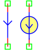
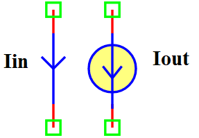

.. include:: ../importCSS.txt

CCCS
====
.. role:: red

:red:`Symbol`

:red:`Information`

The Current-Controlled Current Source (CCCS) block model a linear current-controlled current source, described with the following equation:

.. math::

  	I_{out}=G*I_{in}

where:

* $I_{out}$ is out current  signal [A] flowing from the p2 to the n2 control port.
* $I_{in}$ is in current  signal [A] flowing from the p1 to the n1 control port.
* $G$ is gain multiplier.

:red:`Ports`

* $p1$ Positive terminal type electrical.
* $n1$ Negative terminal type electrical.
* $p2$ Positive terminal type electrical.
* $n2$ Negative terminal type electrical.

:red:`Symbol description`

.. csv-table::
   :header: Field; Value
   :widths: 10, 10
   :delim: ;

   Symbol.name; CCCS
   Symbol.file; CCCS.sym
   Symbol.directory; Basic
   Symbol.referance; ``C``
   Model.name; ``CCCS``
   Model.file; CCCS.py

:red:`PyAMS model`

.. code-block:: py3

  from PyAMS import model,signal,param
  from electrical import current

  #Current-controlled current source model--------------------------------------
  class CCCS(model):
     def __init__(self,p1,n1,p2,n2):
        #Signals declarations---------------------------------------------------
         self.Iin=signal('in',current,p1,n1)
         self.Iout=signal('out',current,p2,n2)
        #Parameter declarations-------------------------------------------------
         self.G=param(1.0,' ','Gain multiplier')

     def analog(self):
         self.Iout+=self.G*self.Iin

:red:`Command syntax`

.. code-block:: py3
    
   #import model
   from CCCS import *
   
   #Cname: is the name of the model.
   #p1,n1,p2,n2: The connection position in the circuit.
   Cname=CCCS(p1,n1,p2,n2)