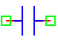

.. include:: ../importCSS.txt

Capacitor
=========

.. role:: red

:red:`Symbol`

:red:`Information`

    A capacitor is another fundamental electronic component used in electronic circuits to store and release electrical energy. Unlike an inductor, which stores energy in a magnetic field, a capacitor stores energy in an electric field. A capacitor is essentially composed of two conductive plates separated by an insulating material called a dielectric.
    The capacitor block models represents a linear capacitor, described with the following equation:

    .. math::

      	I=C \frac{\partial V}{\partial t}

where:

    * $V$ is voltage.
    * $I$ is current.
    * $C$   is the parameter of capacitor, it is allowed to be positive.

:red:`Ports`

    * $p$ Positive terminal type electrical.
    * $n$ Negative terminal type electrical.

:red:`Symbol description`

.. csv-table::
   :header: Field; Value
   :widths: 10, 10
   :delim: ;

   Symbol.name; Capacitor
   Symbol.file; Capacitor.sym
   Symbol.directory; Basic
   Symbol.referance; ``C``
   Model.name; ``Capacitor``
   Model.file; Capacitor.py

:red:`PyAMS model`

.. code-block:: py3

  # File name: lib/Basic/Capacitor.py

  from PyAMS import model,signal,param
  from electrical import voltage,current
  from standardFunction import ddt

  #Capacitor model----------------------------------------------------------------
  class Capacitor(model):
     def __init__(self, p, n):
        #Signals declarations---------------------------------------------------
         self.V = signal('in',voltage,p,n)
         self.I = signal('out',current,p,n)
        #Parameter declarations-------------------------------------------------
         self.C=param(1.0e-6,'F','capacitor multiplier')

     def analog(self):
         #I=C*dV/dt-----------------------------------------------------------
         self.I+=self.C*ddt(self.V)

:red:`Command syntax`

.. code-block:: py3
    
   #import model
   from Capacitor import *
   
   #Cname: is the name of the model.
   #p,n: The connection position in the circuit.
   Cname=Capacitor(p,n)