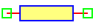
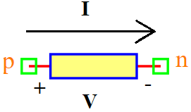

.. include:: ../importCSS.txt

Conductor
=========

.. role:: red

:red:`Symbol`

:red:`Information`

A conductor, in the context of electricity and electronics, is a material that allows the flow of electric charge.
Conductors have low electrical resistance, which means that electrons can move easily through them when a voltage is applied. 
Metals, such as copper and aluminum, are common examples of good electrical conductors.
The Conductor block models represents a linear conductor, described with the following equation:

.. math::

  	I_g=G*V_g

where:

* $V_g$ is voltage.
* $I_g$ is current.
* $G$   is the parameter of conductance, it is allowed to be positive.

:red:`Ports`

* $p$ Positive terminal type electrical.
* $n$ Negative terminal type electrical.

:red:`Symbol description`

.. csv-table::
   :header: Field; Value
   :widths: 10, 10
   :delim: ;

   Symbol.name; Conductor
   Symbol.file; Conductor.sym
   Symbol.directory; Basic
   Symbol.referance; ``G``
   Model.name; ``Conductor``
   Model.file; Conductor.py

:red:`PyAMS model`

.. code-block:: py3

   from PyAMS import model,signal,param
   from electrical import voltage,current

   #Ideal linear electrical conductor
   class Conductor(model):
     def __init__(self, p, n):
        #Signals declarations---------------------------------------------------
         self.Vg = signal('in',voltage,p,n)
         self.Ig = signal('out',current,p,n)

        #Parameter declarations-------------------------------------------------
         self.G=param(1.0,'1/Ohm','Conductance  value')

     def analog(self):
         self.Ig+=self.Vg*self.G

:red:`Command syntax`

.. code-block:: py3
    
   #import model
   from Conductor import *
   
   #Gname: is the name of the model.
   #p,n: The connection position in the circuit.
   Gname=Conductor(p,n)