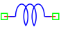

.. include:: ../importCSS.txt

Inductor
========

.. role:: red

:red:`Symbol`

:red:`Information`

 An inductor is an electronic component designed to store energy in the form of a magnetic field when an electric current flows through it. 
 The Inductor block models represents a linear inductor, described with the following equation:

.. math::

  	V=L \frac{\partial I}{\partial t}

where:

* $V$ is voltage.
* $I$ is current.
* $L$   is the parameter of inductor, it is allowed to be positive.

:red:`Ports`

* $p$ Positive terminal type electrical.
* $n$ Negative terminal type electrical.

:red:`Symbol description`

.. csv-table::
   :header: Field; Value
   :widths: 10, 10
   :delim: ;

   Symbol.name; Inductor
   Symbol.file; Inductor.sym
   Symbol.directory; Basic
   Symbol.referance; ``L``
   Model.name; ``Inductor``
   Model.file; Inductor.py

:red:`PyAMS model`

.. code-block:: py3

  from PyAMS import signal,model,param
  from electrical import voltage,current
  from std import ddt

  #Inductor model-----------------------------------------------------------------
  class Inductor(model):
     def __init__(self, p, n):
         #Signals declarations--------------------------------------------------
         self.V = signal('out',voltage,p,n)
         self.I = signal('in',current,p,n)
         #Parameter declarations------------------------------------------------
         self.L=param(1.0e-3,'H','Inductor Value')

     def analog(self):
         #V=L*dI/dt-----------------------------------------------------------
         self.V+=self.L*ddt(self.I)

:red:`Command syntax`

.. code-block:: py3
    
   #import model
   from Inductor import *
   
   #Rname: is the name of the model.
   #p,n: The connection position in the circuit.
   Lname=Inductor(p,n)