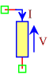
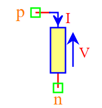

.. include:: ../importCSS.txt

Load
====

.. role:: red

:red:`Symbol`

:red:`Information`

The Load block models represents a linear load, described with the following equation:

.. math::

  	\\ V=R*I \\ P=V*I

where:

* $V$ is voltage signal [V].
* $I$ is current signal [A].
* $R$ is the parameter of resistance, it is allowed to be positive [Ω].
* $P$ is the parameter of power, it is for power calculation [W].

:red:`Ports`

* $p$ Positive terminal type electrical.
* $n$ Negative terminal type electrical.

:red:`Symbol description`

.. csv-table::
   :header: Field; Value
   :widths: 10, 10
   :delim: ;

   Symbol.name; Load
   Symbol.file; Load.sym
   Symbol.directory; Load
   Symbol.referance; ``L``
   Model.name; ``Load``
   Model.file; Load.py

:red:`PyAMS model`

.. code-block:: py3

  from PyAMS import signal,model,param
  from  electrical import voltage,current

  #Load-------------------------------------------------------------------
  class Load(model):
    def __init__(self, p, n):
        #Signals declarations-------------------------------------------
        self.V=signal('out',voltage,p,n)
        self.I=signal('in',current,p,n)

        #Parameters declarations----------------------------------------
        self.R=param(100,'Ω','Resistive')

    def local(self):
        #Local parameter for power calculation
        self.P=param(unit='W',description='Power')

    def analog(self):
        #Mathematical equation between I and V--------------------------
        self.V+=self.R*self.I
        #Power calculation----------------------------------------------
        self.P+=self.V*self.I

:red:`Command syntax`

.. code-block:: py3
    
   #import model
   from Load import *
   
   #Lname: is the name of the model.
   #p,n: The connection position in the circuit.
   Lname=Load(p,n)