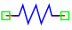
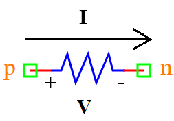

.. include:: ../importCSS.txt

Resistor
========

.. role:: red

:red:`Symbol`

:red:`Information`

A resistor is a fundamental electronic component that opposes the flow of electric current. 
It is used to control the amount of current in a circuit and reduce the voltage that is applied to various 
components within the circuit.The Resistor block models represents a linear resistor, 
described with the following equation (Ohm’s law):

.. math::

    I  = \frac{V}{R}

where:

* $V$ is voltage signal [V].
* $I$ is current signal [A].
* $R$ is the parameter of resistance, it is allowed to be positive [Ω].

:red:`Ports`

* $p$ Positive terminal type electrical.
* $n$ Negative terminal type electrical.

:red:`Symbol description`

.. csv-table::
   :header: Field; Value
   :widths: 10, 10
   :delim: ;

   Symbol.name; Resistor
   Symbol.file; Resistor.sym
   Symbol.directory; Basic
   Symbol.referance; ``R``
   Model.name; ``Resistor``
   Model.file; Resistor.py

:red:`PyAMS model`

The resistor model in PyAMS is

.. code-block:: py3

  from PyAMS import model,signal,param
  from electrical import voltage,current

  #Resistor Model---------------------------------------------------------------
  class Resistor(model):
    def __init__(self, p, n):
        #Signals declarations---------------------------------------------------
        self.V = signal('in',voltage,p,n)
        self.I = signal('out',current,p,n)

        #Parameters declarations------------------------------------------------
        self.R=param(1000.0,'Ω','Resistance value')

    def analog(self):
        #Resistor equation-low hom (I=V/R)--------------------------------------
        self.I+=self.V/self.R

:red:`Command syntax`

.. code-block:: py3
    
   #import model
   from Resistor import *
   
   #Rname: is the name of the model.
   #p,n: The connection position in the circuit.
   Rname=Resistor(p,n)
