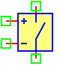
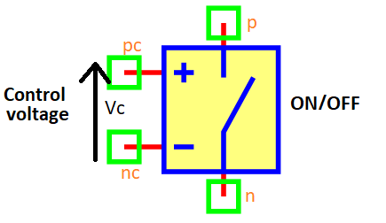

.. include:: ../importCSS.txt

Voltage-controlled switch
=========================

.. role:: red

:red:`Symbol`

:red:`Information`

A voltage controlled switch is a type of switch whose operation is 
controlled by the input voltage at the nodes pc and nc, 
and the switch is turned on or off (open or close) between the nodes p and n.

The voltage-controlled switch described with the following equation:

switch position on
    .. math::

         if(V_c >=V_{on})

         Switch [on]  \Rightarrow Rs=R_{on}

switch position off
    .. math::

         if(V_c <=V_{off})

         Switch[off] \Rightarrow Rs=R_{off}

* The $Rs$ is resistance of switch.
* The $V_c$ is voltage control.
* The $V_{on}$ is voltage for on switch. 
* The $V_{off}$ is voltage for off switch.       	

:red:`Ports`

* $pc$ Positive control voltage terminal.
* $nc$ Negative control voltage terminal.
* $n$  The switch connects.
* $p$  The switch connects.

:red:`Symbol description`

.. csv-table::
   :header: Field; Value
   :widths: 10, 10
   :delim: ;

   Symbol.name; Voltage controlled switch
   Symbol.file; Switch.sym
   Symbol.directory; Basic
   Symbol.referance; ``S``
   Model.name; ``Switch``
   Model.file; Switch.py

:red:`PyAMS model`

The control voltage source model in PyAMS is

.. code-block:: py3

  from PyAMS import model,signal,param
  from electrical import voltage,current
  from Resistor import Resistor

  #Switch control voltage Model--------------------------------------------------
  class Switch(model):
    def __init__(self, pc,nc,p,n):
        #Signals declarations---------------------------------------------------
        self.Vc = signal('in',voltage,pc,nc)

        #Resistor model---------------------------------------------------------
        self.Rs=Resistor(p,n)

        #Parameters declarations------------------------------------------------
        self.Von=param(5.0,'V','Voltage for on switch')
        self.Voff=param(-5.0,'V','Voltage for off switch')
        self.Ron=param(10.0,'Ω','Resistance on value')
        self.Roff=param(1e+6,'Ω','Resistance on value')
        self.Rint=param(10.0,'Ω','Resistance intiale value')

    def sub(self):
        self.Rs.R=self.Rint
        return [self.Rs]

    def analog(self):
        #Switch on vlaue
        if(self.Vc>=self.Von):
            self.Rs.R=self.Ron;

        #Switch off vlaue
        if(self.Vc<=self.Voff):
            self.Rs.R=self.Roff;

:red:`Command syntax`

.. code-block:: py3
    
   #import model
   from Switch import *
   
   #Sname: is the name of the model.
   #pc,nc,p,n: The connection position in the circuit.
   Sname=Switch(pc,nc,p,n)