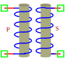

.. include:: ../importCSS.txt

Transformer
===========

.. role:: red

:red:`Symbol`

:red:`Information`

    
A transformer is an electrical device that transfers electrical energy between two or more circuits through electromagnetic induction. 
It consists of two coils of wire, known as the primary and secondary windings, which are electrically insulated from each other. 
These coils are usually wound around a common magnetic core.
The transformer is described with the following equation:

    .. math::

      	V_p=L_p \frac{\partial I_p}{\partial t}+M \frac{\partial I_s}{\partial t}

        V_s=L_s \frac{\partial I_s}{\partial t}+M \frac{\partial I_p}{\partial t}

where:
    * $L_p$, $L_s$, and $M$ are the primary, secondary, and coupling inductances respectively.
    * $V_p$ is voltage in the primary inductor.
    * $I_p$ is current in the primary inductor.
    * $V_s$ is voltage in the secondary inductor.
    * $I_s$ is current in the secondary inductor.

:red:`Ports`

    * $p_1$ Positive terminal type electrical in the primary inductor.
    * $n_1$ Negative terminal type electrical in the primary inductor.
    * $p_2$ Positive terminal type electrical in the secondary inductor.
    * $n_2$ Negative terminal type electrical in the secondary inductor.

:red:`Symbol description`

.. csv-table::
   :header: Field; Value
   :widths: 10, 10
   :delim: ;

   Symbol.name; Transformer
   Symbol.file; Transformer.sym
   Symbol.directory; Basic
   Symbol.referance; ``T``
   Model.name; ``Transformer``
   Model.file; Transformer.py

:red:`PyAMS model`

.. code-block:: py3

  # File name: lib/Basic/Transformer.py

  from PyAMS import model,signal,param
  from signalType import voltage,current
  from std import ddt

  #Behavioral modeling of Transformer----------------------------------------
  class Transformer(model):
       def __init__(self, p1, n1,p2, n2):
           #Declaration of the signals------------------------------------------
           self.Vp = signal('out',voltage,p1, n1)
           self.Ip = signal('in',current,p1, n1)
           self.Vs = signal('out',voltage,p2, n2)
           self.Is = signal('in',current,p2, n2)

          #Parameter declarations-----------------------------------------------
           self.Lp=param(1.0,'H','Primary inductance Value')
           self.Ls=param(1.0,'H','Secondary inductance Value')
           self.M=param(0.5,'H','Coupling inductance Value')

       def analog(self):
           #the equation of transformer-----------------------------------------
           self.Vp+=self.Lp*ddt(self.Ip)+self.M*ddt(self.Is)
           self.Vs+=self.Ls*ddt(self.Is)+self.M*ddt(self.Ip)

:red:`Command syntax`

.. code-block:: py3
    
   #import model
   from Transformer import *
   
   #Tname: is the name of the model.
   #p1, n1,p2, n2: The connection position in the circuit.
   Tname=Transformer(p1, n1,p2, n2))