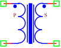

.. include:: ../importCSS.txt

Transformer ideal  
=================

.. role:: red

:red:`Symbol`

:red:`Information`

    In an ideal transformer, there are no energy losses due to factors such as resistance in the windings 
    or core, hysteresis, and eddy current losses. All the power input to the primary winding is transferred to the secondary winding. 
    The ideal transformer described with the following equation:

    .. math::

      	V_s=\frac{V_p}{N}

        I_p=\frac{I_s}{N}

where:
    * $N$ is Winding ratio
    * $V_p$ is voltage in the primary inductor.
    * $I_p$ is current in the primary inductor.
    * $V_s$ is voltage in the secondary inductor.
    * $I_s$ is current in the secondary inductor.

:red:`Ports`

    * $p_1$ Positive terminal type electrical in the primary inductor.
    * $n_1$ Negative terminal type electrical in the primary inductor.
    * $p_2$ Positive terminal type electrical in the secondary inductor.
    * $n_2$ Negative terminal type electrical in the secondary inductor.

:red:`Symbol description`

.. csv-table::
   :header: Field; Value
   :widths: 10, 10
   :delim: ;

   Symbol.name; Transformer Ideal
   Symbol.file; TransformerIdeal.sym
   Symbol.directory; Basic
   Symbol.referance; ``T``
   Model.name; ``TransformerIdeal``
   Model.file; TransformerIdeal.py

:red:`PyAMS model`

.. code-block:: py3

  # File name: lib/Basic/TransformerIdeal.py

  from PyAMS import model,signal,param
  from signalType import voltage,current

  #Behavioral modeling of ideal transformer---------------------------------------------
  class TransformerIdeal(model):
       def __init__(self, p1, n1,p2, n2):

           #Declaration of the signals--------------------------------------------
           self.Vp = signal('in',voltage,p1, n1)
           self.Ip = signal('out',current,p1, n1)
           self.Vs = signal('out',voltage,p2, n2)
           self.Is = signal('in',current,p2, n2)

          #Parameter declarations-------------------------------------------------
           self.N=param(7.0,' ','Winding ratio')

       def analog(self):
           #the equation of ideal transformer-------------------------------------
           self.Vs+=self.Vp/self.N
           self.Ip+=self.Is/self.N

:red:`Command syntax`

.. code-block:: py3
    
   #import model
   from TransformerIdeal import *
   
   #Tname: is the name of the model.
   #p,n: The connection position in the circuit.
   Tname=TransformerIdeal(p1, n1,p2, n2)