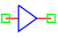

.. include:: ../importCSS.txt

Buffer gate
========

.. role:: red

:red:`Symbol`

:red:`Information`

The Buffer gate is an electronic circuit used to copy a digital input signal and isolate it from any output load.

:red:`Ports`

* $In$ input terminal type electrical.
* $Out$ output terminal type electrical.

:red:`Symbol description`

.. csv-table::
   :header: Field; Value
   :widths: 10, 10
   :delim: ;

   Symbol.name; Buffer
   Symbol.file; Buffer.sym
   Symbol.directory; Digital
   Symbol.referance; ``X``
   Model.name; ``Buffer``
   Model.file; Buffer.py

:red:`PyAMS model`

The Buffer gate model in PyAMS is

.. code-block:: py3

 from PyAMS import model,signal,param
 from electrical import voltage

 # Buffer Gate Model---------------------------------------------------------------
 class Buffer(model):
     def __init__(self,Out,In):
        #Signals declarations---------------------------------------------------
         self.Vin = signal('in',voltage,In)
         self.Vout = signal('out',voltage,Out)

        #Parameter declarations-------------------------------------------------
         self.IL=param(0.2,'V','In low voltage')
         self.IH=param(3.2,'V','In high voltage')
         self.OL=param(0.0,'V','Out low voltage')
         self.OH=param(5.0,'V','Out high voltage')

     def analog(self):
         if(self.Vin<=self.IL):
            self.Vout+=self.OL
         elif(self.Vin>=self.IH):
            self.Vout+=self.OH
