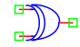

.. include:: ../importCSS.txt

XOR gate
========

.. role:: red

:red:`Symbol`

:red:`Information`

The XOR gate or the 'Exclusive-OR' gate is a circuit which will give a high output if either, but not both, of its two inputs are high.

:red:`Ports`

* $In1$ input terminal type electrical.
* $In2$ input terminal type electrical.
* $Out$ output terminal type electrical.

:red:`Symbol description`

.. csv-table::
   :header: Field; Value
   :widths: 10, 10
   :delim: ;

   Symbol.name; XOR
   Symbol.file; XOR.sym
   Symbol.directory; Digital
   Symbol.referance; ``X``
   Model.name; ``XOR``
   Model.file; XOR.py

:red:`PyAMS model`

The XOR gate model in PyAMS is

.. code-block:: py3

 from PyAMS import model,signal,param
 from electrical import voltage

 # XOR Gate Model----------------------------------------------------------------
 class XOR(model):
     def __init__(self,Out,In1,In2):
        #Signals declarations---------------------------------------------------
         self.Vin1 = signal('in',voltage,In1)
         self.Vin2 = signal('in',voltage,In2)
         self.Vout = signal('out',voltage,Out)
        #Parameter declarations-------------------------------------------------
         self.IL=param(0.2,'V','In low voltage')
         self.IH=param(3.2,'V','In high voltage')
         self.OL=param(0.0,'V','Out low voltage')
         self.OH=param(5.0,'V','Out high voltage')

     def analog(self):
         if((self.Vin1<=self.IL) and (self.Vin2>=self.IH)):
            self.Vout+=self.OH
         elif((self.Vin1>=self.IH) and (self.Vin2<=self.IL)):
            self.Vout+=self.OH
         elif((self.Vin1>=self.IH) and (self.Vin2>=self.IH)):
            self.Vout+=self.OL
         elif((self.Vin1<=self.IL) and (self.Vin2<=self.IL)):
            self.Vout+=self.OL
