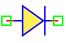
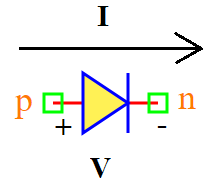

.. include:: ../importCSS.txt

Diode
=====

.. role:: red

:red:`Symbol`

:red:`Information`

The diode is nonlinear element and semiconductor device, described with the following equation $I(V)$:

.. math::

    I  = I_{ss} (exp(\frac{V}{N.V_t})-1)

where:

* $V$ is voltage signal [V].
* $I$ is current signal [A].
* $I_{ss}$ is  reverse bias saturation current (or scale current).
* $V_t$ is the thermal voltage [V].
* $N$  is the ideality factor.

:red:`Ports`

* $p$ Positive terminal type electrical.
* $n$ Negative terminal type electrical.

:red:`Symbol description`

.. csv-table::
   :header: Field; Value
   :widths: 10, 10
   :delim: ;

   Symbol.name; Diode
   Symbol.file; Diode.sym
   Symbol.directory; Semiconductor
   Symbol.referance; ``D``
   Model.name; ``Diode``
   Model.file; Diode.py

:red:`PyAMS model`

The diode model in PyAMS is

.. code-block:: py3

  from PyAMS import signal,model,param
  from electrical import voltage,current
  from standardFunction import explim

  #Simple diode-------------------------------------------------------------------
  class  Diode(model):
     def __init__(self, p, n):
        #Signals declarations---------------------------------------------------
        self.V = signal('in',voltage,p,n)
        self.I = signal('out',current,p,n)

        #Parameter declarations-------------------------------------------------
        self.Iss=param(1.0e-15,'A','Saturation current')
        self.Vt=param(0.025,'V','Thermal voltage')
        self.n=param(1,' ','The ideality factor');

     def analog(self):
        #Mathematical equation between Id and Vd--------------------------------
        self.I+=self.Iss*(explim(self.V/(self.n*self.Vt))-1)
