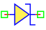
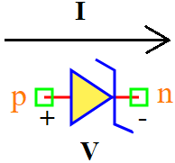

.. include:: ../importCSS.txt

Diode Zener
===========

.. role:: red

:red:`Symbol`

:red:`Information`

The diode zener is nonlinear element and semiconductor device, can be represented by its equivalent nonlinear current source $I$ dependent by the voltage in the nodes $V$ and it is given by: 

.. math::

    I  = I_{ss} (exp(\frac{V}{N.V_t})-1)-I_{BV} (exp(-\frac{V-BV}{N.V_t})-1)

where:

* $V$ is voltage [V].
* $I$ is current [A].
* $I_{ss}$ is  reverse bias saturation current (or scale current) [A].
* $V_t$ is the thermal voltage [V].
* $N$  is the ideality factor.
* $BV$  Breakdown voltage [V].
* $I_{BV}$  Breakdown current [V].

:red:`Ports`

* $p$ Positive terminal type electrical.
* $n$ Negative terminal type electrical.

:red:`Symbol description`

.. csv-table::
   :header: Field; Value
   :widths: 10, 10
   :delim: ;

   Symbol.name; Diode Zener
   Symbol.file; DiodeZener.sym
   Symbol.directory; Semiconductor
   Symbol.referance; ``D``
   Model.name; ``DiodeZener``
   Model.file; DiodeZener.py

:red:`PyAMS model`

The diode zener model in PyAMS is

.. code-block:: py3

 from PyAMS import signal,model,param
 from signalType import voltage,current
 from standardFunction import explim

 #Simple diode zener
 class DiodeZener(model):
     def __init__(self, n, p):
         #Signals declarations--------------------------------------------------
         self.V = signal('in',voltage,n,p)
         self.I = signal('out',current,n,p)

         #Parameter declarations------------------------------------------------
         self.Iss=param(1.0e-12,'A' ,'Saturation current');
         self.Vt=param(0.025,' ','Thermal voltage');
         self.N=param(1.0,' ','Forward emission coefficient');
         self.BV=param(10.0,'V','Breakdown voltage');
         self.IBV=param(0.001,'A','Breakdown current');

     def analog(self):
         #Mathematical equation between I and V---------------------------------
         Id=self.Iss*(explim(self.V/(self.N*self.Vt))-1)
         Ii=self.IBV*(explim(-(self.V+self.self.BV)/(self.N*self.Vt))-1)*-1
         self.I+=Id+Ii;
