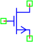
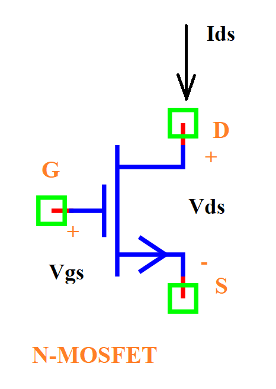

.. include:: ../importCSS.txt

NMOS Transistor
===============

.. role:: red

:red:`Symbol`

:red:`Information`

The MOSFET (Metal Oxide Semiconductor Field Effect Transistor) is an important electronic component, particularly in the microprocessor industry because it is the basic element for building logic gates.
The MOSFET is a three-port component:

* the "drain" (D);
* the "gate" (G);
* the "source" (S).

The voltages are measured relative to the source. We thus measure:

* $V_{DS}$ the voltage between the drain and the source;
* $V_{GS}$ the voltage between the gate and the source;

Finally, for an ideal MOSFET, no current can enter through the gate. Thus, the current that enters through the drain comes out through the source and vice versa. We therefore note this current

* $I_{DS}$ because it is the same in D and in S.

There are two types of MOSFET:

* The “n-channel” MOSFET or NMOS;
* The “p-channel” MOSFET or PMOS;

:red:`Operating regimes of NMOS`

*Cut-off regime*
The MOSFET behaves like an open switch when $V_{GS}\leq V_{th}$, the current $I_{D}$

* $I_{D}=0$.

*Saturation regime*
This regime Saturation when: $V_{GS}>V_{th}$ and $V_{DS}>(V_{GS}-V_{th})$, the current $I_{D}$

* $I_{D}={\frac {K}{2}}(V_{GS}-V_{th})^{2} (1+\lambda V_{DS})$.

*Linear regime (triode)*
This regime occurs when: $V_{GS}>V_{th}$ and $V_{DS}<(V_{GS}-V_{th})$, the current $I_{D}$

* $I_{D}=K((V_{GS}-V_{th})-{\frac {1}{2}}V_{DS})(1+\lambda V_{DS}) V_{DS}$.

:red:`Ports`

* $d$ Drain terminal type electrical.
* $g$ Gate terminal type electrical.
* $s$ Source terminal type electrical.

:red:`Symbol description`

.. csv-table::
   :header: Field; Value
   :widths: 10, 10
   :delim: ;

   Symbol.name; MOSFET (NMOS)
   Symbol.file; NMOS.sym
   Symbol.directory; Semiconductor
   Symbol.referance; ``M``
   Model.name; ``NMOS``
   Model.file; NMOS.py

:red:`PyAMS model`

.. code-block:: py3

 from PyAMS import signal,model,param
 from electrical import voltage,current

 #Simple N-channel MOSFET model--------------------------------------------------
 class NMOS(model):
      def __init__(self,d,g,s):
           #Signals-------------------------------------------------------------
           self.Vgs=signal('in',voltage,g,s)
           self.Vds=signal('in',voltage,d,s)
           self.Id=signal('out',current,d,s)
           self.Ig=signal('out',current,g,'0')
           #Paramaters----------------------------------------------------------
           self.Kp=param(200e-6,'A/V^2','Transconductance coefficient')
           self.W=param(100.0e-6,'m','Channel width')
           self.L=param(100.0e-6,'m','Channel length')
           self.Vt=param(0.5,'V','Threshold voltage')
           self.lambd=param(0.000,'1/V','Channel-length modulation')
     
      def analog(self):     
          K=self.Kp*self.W/self.L 
          self.Ig+=0.0  
          if self.Vgs <= self.Vt:
                self.Id+=0.0
          elif (self.Vgs-self.Vt)<self.Vds:
                self.Id+=K*(self.Vgs-self.Vt)*(self.Vgs-self.Vt)*(1+(self.lambd*self.Vds))/2  
          else:
                self.Id+=K*((self.Vgs-self.Vt)-(self.Vds/2))*(1+(self.lambd*self.Vds))*self.Vds 
