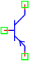

.. include:: ../importCSS.txt

PNP Transistor
===============

.. role:: red

:red:`Symbol`

:red:`Information`

.. figure:: PNP.png
   :scale: 50%
   :align: center

The PNP Transistors are three-terminal, three-layer devices that can function as either amplifiers or electronic switches, 
The BJT (PNP) which is represented by The Ebers-Moll model,The equivalent of the transistor can be represented by three current sources Ic, Ib and Ie it is dependent on the voltage in the three nodes c, b and e: 

.. math::

   I_c=-I_{ct}+\frac{1}{Br}I_{ce}

   I_e=I_{ct}+\frac{1}{Bf}I_{cc}

   I_b=-\frac{1}{BR}I_{ce}-\frac{1}{BF}I_{cc}

for

.. math::

   I_{cc}=I_{ss}(exp(\frac{-V_{be}}{Nf.V_t})-1)

   I_{ce}=I_{ss}(exp(\frac{-V_{bc}}{Nr.V_t})-1)

   I_{ct}=(I_{cc}-I_{ce})(1-\frac{-V_{bc}}{V_{af}}-\frac{-V_{be}}{V_{ar}})

and

.. math::

   I_c+I_b+I_e=0

where:

* $V_{be}$ is voltage signal between base and emitter [V].
* $V_{bc}$ is voltage signal between base and collector [V].
* $I_c$ is current signal of collector[A].
* $I_e$ is current signal of emitter[A].
* $I_b$ is current signal of base[A].
* $I_{ss}$ is  reverse bias saturation current (or scale current).
* $V_t$ is the thermal voltage [V].
* $Nf$  is the ideality factor (forward).
* $Nr$  is the ideality factor (reverse).
* $V_{ar}$ the reverse Early voltage[V].
* $V_{af}$ the forward Early voltage[V].
* $Br$ the reverse current gains.
* $Bf$ the forward  current gains.

:red:`Ports`

* $b$ Base terminal type electrical.
* $c$ Collector terminal type electrical.
* $e$ Emitter terminal type electrical.

:red:`Symbol description`

.. csv-table::
   :header: Field; Value
   :widths: 10, 10
   :delim: ;

   Symbol.name; BJT (PNP)
   Symbol.file; PNP.sym
   Symbol.directory; Semiconductor
   Symbol.referance; ``Q``
   Model.name; ``PNP``
   Model.file; PNP.py

:red:`PyAMS model`

The PNP model in PyAMS is

.. code-block:: py3

  from PyAMS import signal,model,param
  from electrical import voltage,current
  from standardFunction import explim

  #Ideal BJT (NPN)---------------------------------------------------------------

  class PNP(model):
      def __init__(self,c,b,e):
           #Signals-------------------------------------------------------------
           self.Vbe=signal('in',voltage,b,e)
           self.Vbc=signal('in',voltage,b,c)
           self.Vce=signal('in',voltage,c,e)
           self.Ic=signal('out',current,c)
           self.Ib=signal('out',current,b)
           self.Ie=signal('out',current,e)

           #paramaters----------------------------------------------------------
           self.Nf=param(1.0,' ','Forward current emission coefficient')
           self.Nr=param(1.0,' ','current emission coefficient')
           self.Is=param(1.0e-16,'A','Transport saturation current')
           self.area=param(1.0,' ','Area')
           self.Br=param(1.0,' ','Ideal maximum reverse beta')
           self.Bf=param(100.0,' ','Ideal maximum forward beta')
           self.Vt=param(0.025,'V','Voltage equivalent of temperature')
           self.Nf=param(1.0,' ','Forward current emission coefficient')
           self.Nr=param(1.0,' ','current emission coefficient')
           self.Is=param(1.0e-16,'A','Transport saturation current')
           self.area=param(1.0,' ','Area')
           self.Br=param(1.0,' ','Ideal maximum reverse beta')
           self.Bf=param(100.0,' ','Ideal maximum forward beta')
           self.Vt=param(0.025,'V','Voltage equivalent of temperature')
           self.Var=param(1e+3,'V','Reverse Early voltage');
           self.Vaf=param(1e+3,'V','Forward Early voltage');
           self.gmin=param(1e-12,'1/Ohm','Inductance')
           self.gmin=param(1e-12,'1/Ohm','Inductance')

      def analog(self):

            Vt=self.Vt
            Icc=self.Is*(explim(-self.Vbe/(self.Nf*Vt))-1)
            Ice=self.Is*(explim(-self.Vbc/(self.Nr*Vt))-1)
            Ict=(Icc-Ice)*(1-self.Vbc/self.Vaf-self.Vbe/self.Var)
            self.Ic+=+Ict+Ice/self.Br+self.gmin*self.Vbc
            self.Ib+=-Ice/self.Br-Icc/self.Bf
            self.Ie+=Ict+Icc/self.Bf+self.gmin*self.Vbe
