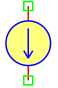
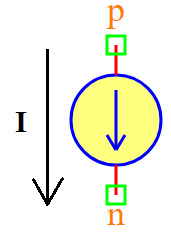

.. include:: ../importCSS.txt

DC current
==========
.. role:: red

:red:`Symbol`

:red:`Information`

The DCCurrent block models represents a the direct current between the two points, described with the following equation:

.. math::

    I =Idc

where:

* $I$ is current.
* $Idc$ is the parameter represent value of constant current.

:red:`Ports`

* $p$ Positive terminal type electrical.
* $n$ Negative terminal type electrical.

:red:`Symbol description`

.. csv-table::
   :header: Field; Value
   :widths: 10, 10
   :delim: ;

   Symbol.name; DC Current
   Symbol.file; DCCurrent.sym
   Symbol.directory; Basic
   Symbol.referance; ``G``
   Model.name; ``DCCurrent``
   Model.file; DCCurrent.py

:red:`PyAMS model`

.. code-block:: py3

  from PyAMS import signal,param,model
  from signalType import current

  #Source for constant current----------------------------------------------------
  class DCCurrent(model):
     def __init__(self, p, n):
         #Signal declarations---------------------------------------------------
         self.I = signal('out',current,p,n)

         #Parameters declarations-----------------------------------------------
         self.Idc=param(0.001,'A','Value of constant current')
     def analog(self):
         self.I+=self.Idc

:red:`Command syntax`

.. code-block:: py3
    
   #import model
   from DCCurrent import *
   
   #Iname: is the name of the model.
   #p,n: The connection position in the circuit.
   Iname=DCCurrent(p,n)