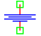
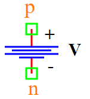

.. include:: ../importCSS.txt

DC voltage
==========

.. role:: red

:red:`Symbol`

:red:`Information`

The DCVoltage block models represents a the direct voltage between the two points, described with the following equation:

.. math::

    V =Vdc

where:

* $V$ is voltage.
* $Vdc$ is the parameter represent value of constant voltage.

:red:`Ports`

* $p$ Positive terminal type electrical.
* $n$ Negative terminal type electrical.

:red:`Symbol description`

.. csv-table::
   :header: Field; Value
   :widths: 10, 10
   :delim: ;

   Symbol.name; DC Voltage
   Symbol.file; DCVoltage.sym
   Symbol.directory; Source
   Symbol.referance; ``S``
   Model.name; ``DCVoltage``
   Model.file;  DCVoltage.py

:red:`PyAMS model`

.. code-block:: py3

  from PyAMS import signal,param,model
  from  electrical  import voltage

  #Source for constant voltage----------------------------------------------------
  class DCVoltage(model):
     def __init__(self, p, n):
         #Signals declarations--------------------------------------------------
         self.V=signal('out',voltage,p,n)

         #Parameters declarations-----------------------------------------------
         self.Vdc=param(15.0,'V','Value of constant voltage')

     def analog(self):
         self.V+=self.Vdc

:red:`Command syntax`

.. code-block:: py3
    
   #import model
   from DCVoltage import *
   
   #Vname: is the name of the model.
   #p,n: The connection position in the circuit.
   Vname=DCVoltage(p,n)