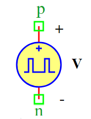

.. include:: ../importCSS.txt

Puls voltage
===========
.. role:: red

:red:`Symbol`

:red:`Information`

A puls wave voltage source is an electrical component that generates a rectangular voltage in a the duty cycle of period T. That describe its shape as shown in figure.

where:

* $Va$   is the parameter of amplitude of square wave voltage [A].
* $D$    is the duty cycle
* $T$    is the parameter represent period of wave [Sec].

:red:`Ports`

* $p$ Positive terminal type electrical.
* $n$ Negative terminal type electrical.

:red:`Symbol description`

.. csv-table::
   :header: Field; Value
   :widths: 10, 10
   :delim: ;

   Symbol.name; Puls Voltage
   Symbol.file; PulsVoltage.sym
   Symbol.directory; Source
   Symbol.referance; ``V``
   Model.name; ``PulsVoltage``
   Model.file; PulsVoltage.py

:red:`PyAMS model`

.. code-block:: py3

 from PyAMS import model,signal,param, time
 from electrical import voltage

 #Source for puls voltage-----------------------------------------------------
 class PulsVoltage(model):
     def __init__(self, p, n):
         #Signal  declaration--------------------------------------------------
         self.V= signal('out',voltage,p,n)

         #Parameters declarations----------------------------------------------
         self.Va=param(1.0,'V','Amplitude of square wave voltage  ')
         self.T=param(0.1,'Sec','Period')
         self.D=param(50,'%','Duty cycle')
         self.Voff=param(0.0,'V','Offset voltage')

     def analog(self):
         n=time-int(time/self.T)*self.T
  
         if(n<=self.T*self.D/100):
             self.V+=self.Va+self.Voff
         else:
             self.V+=self.Voff

:red:`Command syntax`

.. code-block:: py3
    
   #import model
   from PulsVoltage import *
   
   #Vname: is the name of the model.
   #p,n: The connection position in the circuit.
   Vname=PulsVoltage(p,n)