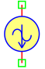
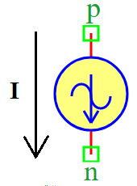

.. include:: ../importCSS.txt

Sin current
===========
.. role:: red

:red:`Symbol`

:red:`Information`

The SinCurrent block models represents a the sine wave current between the two points, described with the following equation:

.. math::

    I =Ioff+Ia*sin(2*pi*Fr*t+Ph*pi/180°)

where:

* $I$ is current [A].
* $Ioff$ is the parameter represent current offset [A].
* $Ia$   is the parameter represent amplitude of sine wave [A].
* $Fr$   is the parameter represent frequency of sine wave [Hz].
* $t$    is the parameter represent time [Sec].
* $Ph$   is the parameter represent phase of sine wave [°].

:red:`Ports`

* $p$ Positive terminal type electrical.
* $n$ Negative terminal type electrical.

:red:`Symbol description`

.. csv-table::
   :header: Field; Value
   :widths: 10, 10
   :delim: ;

   Symbol.name; Sin Current
   Symbol.file; SinCurrent.sym
   Symbol.directory; Source
   Symbol.referance; ``I``
   Model.name; ``SinCurrent``
   Model.file; SinCurrent.py

:red:`PyAMS model`

.. code-block:: py3

 from PyAMS import signal, param, model, time
 from electrical import current
 from math  import sin, pi

 #Sine wave Voltage  source------------------------------------------------------
 class SinCurrent(model):
     def __init__(self, p, n):
         #Signal  declaration--------------------------------------------------
         self.I = signal('out',current,p,n)

         #Parameters declarations----------------------------------------------
         self.Fr=param(100.0,'Hz','Frequency of sine wave')
         self.Ia=param(1.0,'A','Amplitude of sine wave')
         self.Ph=param(0.0,'°','Phase of sine wave')
         self.Ioff=param(0.0,'A','Current offset')
  
     def analog(self):
          self.I+=self.Ia*sin(pi*2.0*self.Fr*time+self.Ph*pi/180.0)+self.Ioff

:red:`Command syntax`

.. code-block:: py3
    
   #import model
   from SinCurrent import *
   
   #Iname: is the name of the model.
   #p,n: The connection position in the circuit.
   Iname=SinCurrent(p,n)