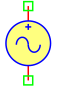
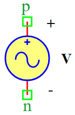

.. include:: ../importCSS.txt

Sin voltage
===========
.. role:: red

:red:`Symbol`

:red:`Information`

The SinVoltage block models represents a the sine wave voltage between the two points, described with the following equation:

.. math::

    V =Voff+Va*sin(2*pi*Fr*t+Ph*pi/180°)

where:

* $V$ is voltage signal [V].
* $Voff$ is the parameter represent voltage offset [V].
* $Va$   is the parameter represent amplitude of sine wave [V]
* $Fr$   is the parameter represent frequency of sine wave [Hz].
* $t$    is the parameter represent time [Sec].
* $Ph$   is the parameter represent phase of sine wave [°].

:red:`Ports`

* $p$ Positive terminal type electrical.
* $n$ Negative terminal type electrical.

:red:`Symbol description`

.. csv-table::
   :header: Field; Value
   :widths: 10, 10
   :delim: ;

   Symbol.name; Sin Voltage
   Symbol.file; SinVoltage.sym
   Symbol.directory; Source
   Symbol.referance; ``S``
   Model.name; ``SinVoltage``
   Model.file; SinVoltage.py

:red:`PyAMS model`

.. code-block:: py3

 from PyAMS import signal, param, model, time
 from electrical import voltage
 from math  import sin, pi

 #Sine wave Voltage  source------------------------------------------------------
 class SinVoltage(model):
     def __init__(self, p, n):
         #Signal  declaration--------------------------------------------------
         self.V = signal('out',voltage,p,n)

         #Parameters declarations----------------------------------------------
         self.Fr=param(100.0,'Hz','Frequency of sine wave')
         self.Va=param(10.0,'V','Amplitude of sine wave')
         self.Ph=param(0.0,'°','Phase of sine wave')
         self.Voff=param(0.0,'V','Voltage offset')
  
     def analog(self):
          self.V+=self.Va*sin(pi*2.0*self.Fr*time+self.Ph*pi/180.0)+self.Voff

:red:`Command syntax`

.. code-block:: py3
    
   #import model
   from SinVoltage import *
   
   #Vname: is the name of the model.
   #p,n: The connection position in the circuit.
   Vname=SinVoltage(p,n)