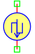
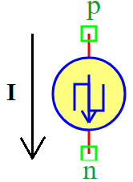
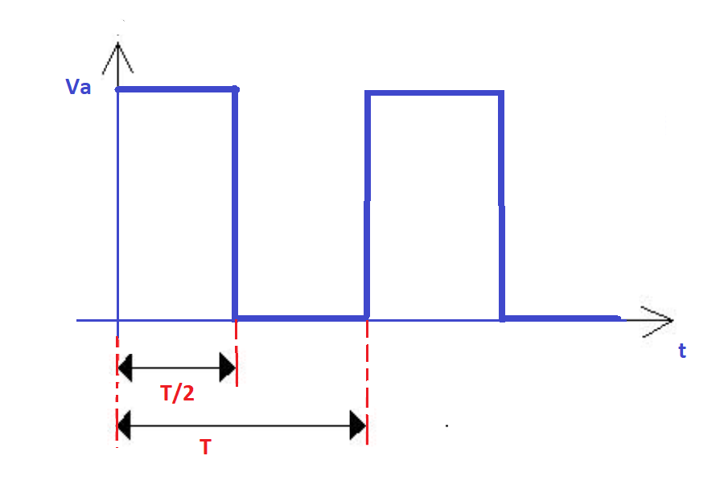

.. include:: ../importCSS.txt

Square current
==============
.. role:: red

:red:`Symbol`

:red:`Information`

A square wave current source is an electrical component that generates a rectangular currrent in a half-period T. That describe its shape as shown in figure.

where:

* $Ia$   is the parameter of amplitude of square wave current [A].
* $T$    is the parameter represent period of wave [Sec].

:red:`Ports`

* $p$ Positive terminal type electrical.
* $n$ Negative terminal type electrical.

:red:`Symbol description`

.. csv-table::
   :header: Field; Value
   :widths: 10, 10
   :delim: ;

   Symbol.name; Square Current
   Symbol.file; SquareCurrent.sym
   Symbol.directory; Source
   Symbol.referance; ``I``
   Model.name; ``SquareCurrent``
   Model.file; SquareCurrent.py

:red:`PyAMS model`

.. code-block:: py3

 from PyAMS import model,signal,param, time
 from electrical import current

 #Source for square current------------------------------------------------------
 class SquareCurrent(model):
     def __init__(self, p, n):
         #Signal  declaration---------------------------------------------------
         self.I = signal('out',current,p,n)

         #Parameters declarations-----------------------------------------------
         self.Ia=param(1.0,'A','Amplitude of square wave current  ')
         self.T=param(0.1,'Sec','Period')
         self.Ioff=param(0.0,'A','Offset current')

     def analog(self):
         n=time-int(time/self.T)*self.T
  
         if(n<=self.T/2):
             self.I+=self.Ia+self.Ioff
         else:
             self.I+=self.Ioff

:red:`Command syntax`

.. code-block:: py3
    
   #import model
   from SquareCurrent import *
   
   #Iname: is the name of the model.
   #p,n: The connection position in the circuit.
   Iname=SquareCurrent(p,n)