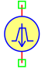
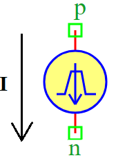
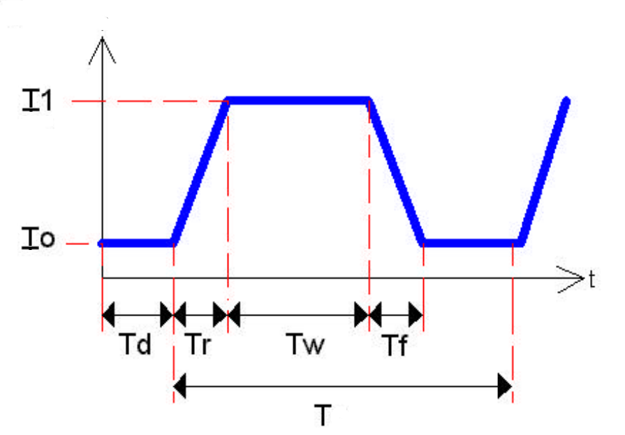

.. include:: ../importCSS.txt

Trapezoid current
=================
.. role:: red

:red:`Symbol`

:red:`Information`

A current trapezoid or pulse train can be applied as an independent source in PyAMS using has seven parameters that describe its shape as shown in figure.

where:

* $I$    is current signal [V].
* $Io$   is the parameter of initial current [V].
* $I1$   is the parameter of peak current [V].
* $Td$   is the parameter represent initial delay time [Sec].
* $Tr$   is the parameter represent rise time [Sec].
* $Tf$   is the parameter represent fall time [Sec].
* $Tw$   is the parameter represent pulse-width [Sec].
* $T$    is the parameter represent period of wave [Sec].

:red:`Ports`

* $p$ Positive terminal type electrical.
* $n$ Negative terminal type electrical.

:red:`Symbol description`

.. csv-table::
   :header: Field; Value
   :widths: 10, 10
   :delim: ;

   Symbol.name; Trapezoid Current
   Symbol.file; TrapezoidCurrent.sym
   Symbol.directory; Source
   Symbol.referance; ``I``
   Model.name; ``TrapezoidCurrent``
   Model.file; TrapezoidCurrent.py

:red:`PyAMS model`

.. code-block:: py3

 from PyAMS import model,time,signal,param
 from electrical import current

 #Source for Trapezoid current---------------------------------------------------
 class TrapezoidCurrent(model):
     def __init__(self, a, b):
         #Signal  declaration---------------------------------------------------
         self.I = signal('out',current,a,b)

         #Parameters declarations-----------------------------------------------
         self.I0=param(1.0,'A','Initial current ')
         self.I1=param(1.0,'A','Peak current ')
         self.Td=param(0,'Sec','Initial delay time')
         self.Tr=param(0,'Sec','Rise time')
         self.Tw=param(0.05,'Sec','Pulse-width')
         self.Tf=param(0,'Sec','Fall time')
         self.T=param(0.1,'Sec','Period of wave')
         self.Ioff=param(0.0,'A','Offset current')

     def analog(self):
         n=(time-self.Td)-int((time-self.Td)/self.T)*self.T
         if(time<=self.Td):
            self.I+=self.I0+self.Ioff
         elif(n<=self.Tr):
            a=(self.I1-self.I0)/self.Tr
            self.I+=a*n+self.I0+self.Ioff 
         elif(n<=(self.Tr+self.Tw)):
            self.I+=self.I1+self.Ioff
         elif(n<=(self.Tr+self.Tw+self.Tf)):
            a=(self.I0-self.I1)/self.Tf
            self.I+=a*(n-self.Tr-self.Tw)+self.I1+self.Ioff
         else:
            self.I+=self.I0

:red:`Command syntax`

.. code-block:: py3
    
   #import model
   from TrapezoidCurrent import *
   
   #Iname: is the name of the model.
   #p,n: The connection position in the circuit.
   Iname=TrapezoidCurrent(p,n)