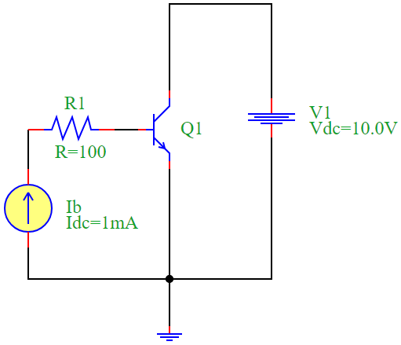

.. _bjt_characteristics:

BJT Characteristics Analysis
============================

Introduction
------------
A **Bipolar Junction Transistor (BJT)** is a semiconductor device used for amplification and switching applications. In this document, we analyze the **collector current (I\ :sub:`C`) versus collector-emitter voltage (V\ :sub:`CE`)** characteristics for different base currents (I\ :sub:`B`).

Equations
---------
The fundamental equation governing the BJT in active mode is:

.. math::
    I_C = \beta I_B

where:

- :math:`I_C` is the collector current,
- :math:`I_B` is the base current,
- :math:`\beta` is the current gain of the transistor.

The collector-emitter voltage is given by:

.. math::
    V_{CE} = V_C - V_E

Circuit Description
-------------------
The circuit consists of:

- A DC current source supplying base current (:math:`I_B`),
- A DC voltage source (:math:`V_{CC}`),
- An NPN transistor (:math:`Q_1`),
- A resistor (:math:`R_1`) to limit base current.

Circuit Diagram
---------------

Python Simulation Code
----------------------
The following Python script simulates the BJT characteristics using the **PyAMS library**:

.. code-block:: python

    from pyams_lib import circuit
    from models import DCCurrent, DCVoltage, NPN, Resistor
    import matplotlib.pyplot as plt

    # Define elements
    Ib = DCCurrent("0", "N02")
    V1 = DCVoltage("N01", "0")
    Q1 = NPN("N01", "N04", "0")
    R1 = Resistor("N02", "N04")

    # Set component values
    Ib.setParams("Idc=1mA")
    V1.setParams("Vdc=10.0V")
    Q1.setParams("Bf=100.0 Br=1.0 Is=1e-16 Nf=1.0 Nr=1.0 Vaf=10 Var=10 Vt=0.025 area=1.0 gmin=1e-12")
    R1.setParams("R=100")

    # Create circuit and add elements
    circuit = circuit()
    circuit.addElements({'Ib': Ib, 'V1': V1, 'Q1': Q1, 'R1': R1})

    # Set outputs for plotting
    circuit.setOutPuts(Q1.Vce, Q1.Ic)
    circuit.analysis(mode="dc", param=V1.Vdc, start=0, stop=0.4, step=0.001)

    # Execute and plot for different base currents
    plt.figure(figsize=(10, 6))
    for i in [10, 20, 30, 40]:
        print(f"\nCurrent value of Ib: {i}mA")
        Ib.Idc += i / 1000
        circuit.run()
        Vce, Ic = circuit.getOutPuts()
        label = f"Current value of Ib: {i}mA"
        plt.plot(Vce, Ic, label=label)

    plt.xlabel("Vce(V)")
    plt.ylabel("Ic(A)")
    plt.title("BJT Characteristics")
    plt.legend()
    plt.grid(True)
    plt.tight_layout()
    plt.show()

Simulation Results
------------------
The results obtained from the simulation show how the collector current varies with the collector-emitter voltage for different base currents.

.. image:: BJT_characteristics_result.png
    :alt: BJT Characteristics Results

Conclusion
----------
This simulation provides insights into the BJT's behavior under different base currents, demonstrating its amplification properties. The **collector current increases with base current**, confirming the fundamental transistor operation principle.

