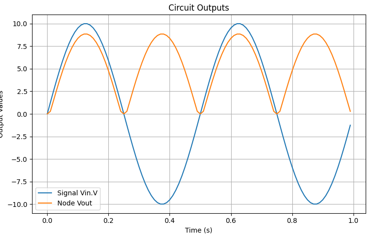

Full-Wave Bridge Rectifier Circuit Simulation
=============================================

Overview
--------

The **Full-Wave Bridge Rectifier** is an essential circuit used for AC to DC conversion. It utilizes four diodes arranged in a bridge configuration to rectify both halves of the AC waveform.

- When the input **Vin** is positive, two diodes conduct, allowing current to flow through the load resistor **R1**.
- When **Vin** is negative, the other two diodes conduct, ensuring the current through **R1** always flows in the same direction.
- The output voltage **Vout** is a full-wave rectified signal.

Mathematical Formulation
------------------------

The output voltage in a half-wave rectifier is given by:

.. math::

   V_{out} = abss(V_m \sin(\omega t))

where:

- :math:`V_m` is the peak voltage of the AC source.
- :math:`\omega` is the angular frequency of the AC signal (:math:`\omega = 2\pi f`).
- :math:`t` is the time variable.

Circuit Diagram
---------------

The following diagram illustrates the **Full-Wave Bridge Rectifier** circuit:

.. image:: Ful_wave_bridge_rectifier.png
   :align: center
   :alt: Full-Wave Bridge Rectifier Circuit Diagram

Simulation Code
---------------

The following Python script simulates the full-wave bridge rectifier circuit using **PyAMS**:

.. code-block:: python

   from pyams.lib import circuit
   from models import Resistor, SinVoltage, DiodeBridge
   
   # Define Components
   R1 = Resistor("Vout", "0")
   Vin = SinVoltage("N04", "N03")
   D1 = DiodeBridge("N04", "Vout", "N03", "0")
   
   # Set Component Parameters
   R1.setParams("R=1KΩ")
   Vin.setParams("Fr=2Hz Ph=0.0 Va=10V Voff=0.0")
   D1.setParams("Iss=1pA Vt=25mV")
   
   # Create Circuit and Add Elements
   circuit = circuit()
   circuit.addElements({"R1": R1, "Vin": Vin, "D1": D1})
   
   # Set Outputs for Plotting
   circuit.setOutPuts(Vin.V, "Vout")
   
   # Perform Transient Analysis
   circuit.analysis(mode="tran", start=0, stop=1, step=0.01)
   circuit.run()
   circuit.plot()

Simulation Output
-----------------

The rectified output waveform **Vout** confirms the expected full-wave rectification behavior. The following plot shows the input AC signal and the rectified output:

Conclusion
----------

The **Full-Wave Bridge Rectifier** effectively converts AC to DC, making it a fundamental component in power supplies. The simulation results validate its operation by demonstrating a rectified output waveform.

