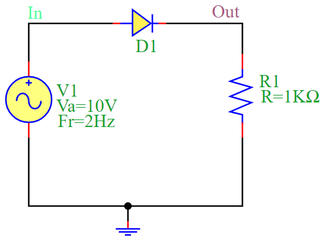
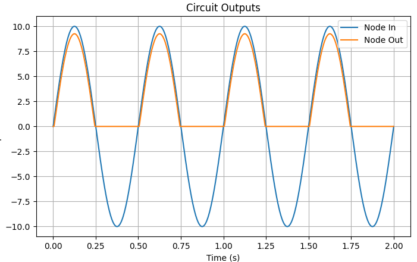

Half-Wave Rectification Circuit
==============================

Overview
--------

The half-wave rectification circuit consists of a **diode (D1)** and a **resistor (R1)** connected in series with an **AC voltage source (V1)**. The circuit allows only one half-cycle (positive) of the AC voltage to pass while blocking the other half-cycle (negative).

- During the positive half-cycle of the input voltage, the **diode conducts**, allowing current to pass through **R1**, generating a positive output voltage.
- During the negative half-cycle, the **diode blocks the current**, resulting in **zero output voltage**.

Mathematical Formulation
------------------------

The output voltage in a half-wave rectifier is given by:

.. math::

   V_{out} = V_m \sin(\omega t) \quad \text{for } V_{in} > 0

   V_{out} = 0 \quad \text{for } V_{in} < 0

where:

- :math:`V_m` is the peak voltage of the AC source.
- :math:`\omega` is the angular frequency of the AC signal (:math:`\omega = 2\pi f`).
- :math:`t` is the time variable.

Circuit Diagram
---------------

The following diagram illustrates the half-wave rectification circuit:

Simulation Code
---------------

The following Python script simulates the **half-wave rectification** circuit using the **PyAMS library**:

.. code-block:: python

   from pyams.lib import circuit
   from models import Resistor, SinVoltage, Diode

   # Define components
   R1 = Resistor("Out", "0")
   V1 = SinVoltage("In", "0")
   D1 = Diode("In", "Out")

   # Set component parameters
   R1.setParams("R=1KΩ")
   V1.setParams("Va=10V Fr=2Hz")

   # Create circuit and add elements
   circuit = circuit()
   circuit.addElements({"R1": R1, "V1": V1, "D1": D1})

   # Set output for plotting
   circuit.setOutPuts("In", "Out")

   # Perform transient analysis
   circuit.analysis(mode="tran", start=0, stop=2, step=0.001)
   circuit.run()
   circuit.plot()

Simulation Output
-----------------

The output waveform of the rectifier circuit shows the rectified AC signal, where only the positive half-cycles appear at the output. The simulation produces the following waveform:

Conclusion
----------

The half-wave rectifier is a basic **AC-to-DC conversion circuit** that allows only one half of the AC waveform to pass. While simple, it is inefficient because it discards half of the input signal. This circuit is useful in low-power applications where a full-wave rectifier is unnecessary.

