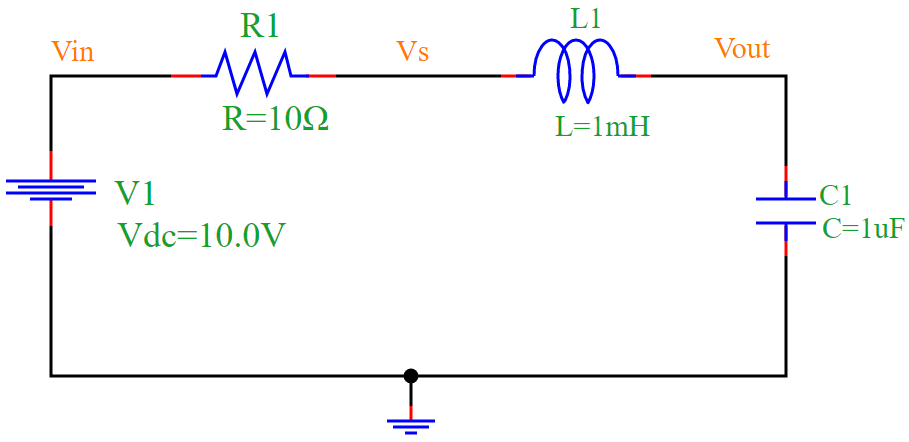
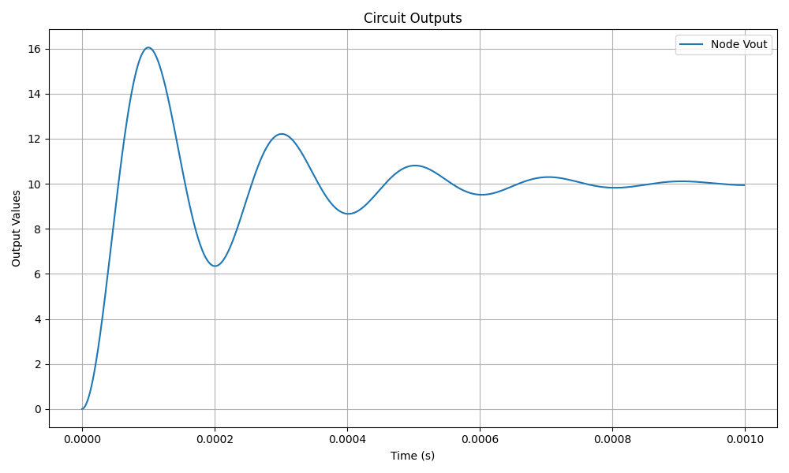

RLC Circuit Simulation
===============================

This document describes the implementation of an RLC circuit using `pyams.lib` for transient analysis. The simulation evaluates the voltage and current characteristics over time.

RLC Circuit
------------

The RLC circuit consists of a resistor, inductor, and capacitor connected in series with a DC voltage source.

   **Figure 1**: RLC Circuit Diagram.

The governing equation for an RLC circuit is:

.. math::

   V = iR + L \frac{di}{dt} + \frac{1}{C} \int i dt

Where:

- :math:`V_R = i R`
- :math:`V_L = L \frac{di}{dt}`
- :math:`V_C = \frac{1}{C} \int i dt`

Solving the Differential Equation
---------------------------------

The second-order differential equation governing the circuit is:

.. math::

   L \frac{d^2i}{dt^2} + R \frac{di}{dt} + \frac{i}{C} = V

For a step input (DC voltage :math:`V = V_0`), the homogeneous solution is:

.. math::

   i_h(t) = A e^{s_1 t} + B e^{s_2 t}

where :math:`s_1` and :math:`s_2` are the roots of the characteristic equation:

.. math::

   Ls^2 + Rs + \frac{1}{C} = 0

The roots determine the system response:

1. **Overdamped**: :math:`R^2 > 4L/C`, distinct real roots.
2. **Critically damped**: :math:`R^2 = 4L/C`, repeated real root.
3. **Underdamped**: :math:`R^2 < 4L/C`, complex conjugate roots leading to oscillations.

For the **underdamped case**, the solution takes the form:

.. math::

   i(t) = e^{-\alpha t} (A \cos(\omega_d t) + B \sin(\omega_d t))

where:

- :math:`\alpha = \frac{R}{2L}`
- :math:`\omega_d = \sqrt{\frac{1}{LC} - \alpha^2}`

Numerical Application
---------------------

Given the circuit parameters:

- :math:`R = 10 \Omega`
- :math:`L = 1 \text{mH} = 1 \times 10^{-3} \text{H}`
- :math:`C = 1 \text{μF} = 1 \times 10^{-6} \text{F}`
- :math:`V_0 = 10V`

We calculate:

1. **Damping coefficient**:

   .. math::

      \alpha = \frac{R}{2L} = \frac{10}{2 \times 10^{-3}} = 5000 \text{ s}^{-1}

2. **Resonant frequency**:

   .. math::

      \omega_0 = \frac{1}{\sqrt{LC}} = \frac{1}{\sqrt{(1 \times 10^{-3}) (1 \times 10^{-6})}}

      \omega_0 = 10^6 \text{ rad/s}

3. **Damped frequency**:

   .. math::

      \omega_d = \sqrt{\omega_0^2 - \alpha^2} = \sqrt{(10^6)^2 - (5000)^2}

      \omega_d \approx 999987.5 \text{ rad/s}

Since :math:`\alpha^2 \ll \omega_0^2`, the circuit is **underdamped** and exhibits oscillations.

Python Code for RLC Circuit
---------------------------

The following Python script models the RLC circuit using `pyams.lib`:

.. code-block:: python

   from pyams.lib import circuit
   from models import Resistor, DCVoltage, Capacitor, Inductor

   # Define circuit elements
   V1 = DCVoltage("Vin", "0")
   R1 = Resistor("Vin", "Vs")
   L1 = Inductor("Vs", "Vout")
   C1 = Capacitor("Vout", "0")

   # Set parameters
   R1.setParams("R=10")
   V1.setParams("Vdc=10V")
   L1.setParams("L=1mH")
   C1.setParams("C=1uF")

   # Create circuit and add elements
   circuit = circuit()
   circuit.addElements({'V1': V1, 'R1': R1, 'L1': L1, 'C1': C1})

   # Set analysis outputs
   circuit.analysis(mode="tran", start=0, stop=1e-3, step=1e-6)
   circuit.setOutPuts("Vout", R1.I)

   # Run simulation and plot results
   circuit.run()
   circuit.plot()

Simulation Results
------------------

The transient response of the RLC circuit is obtained using the Python script below. The results show the voltage across the capacitor (`Vout`) and the current through the resistor (`R1.I`).

   **Figure 2**: Voltage Output (`Vout`) of the RLC circuit.

.. figure:: RLCFigure_2.png
   :align: center
   :alt: Current Output of RLC Circuit

   **Figure 3**: Current through Resistor (`R1.I`) in the RLC circuit.

Conclusion
----------

The simulation successfully analyzes the transient response of an RLC circuit. The plotted results illustrate the characteristic oscillatory behavior of the circuit.

