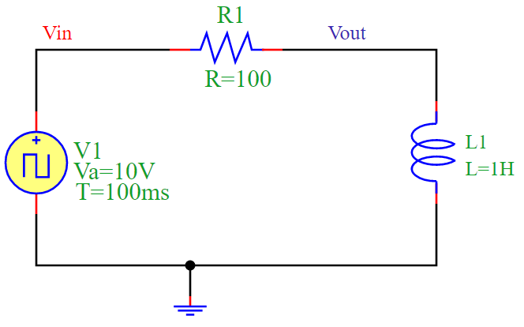

RL Circuit Simulation
=====================

Overview
--------

The circuit consists of a **resistor (R1)** and an **inductor (L1)** forming an RL circuit. The circuit is driven by a **square wave voltage source (V1)**.

- When the input voltage **Vin** switches from low to high, the inductor **L1** resists the change in current, causing a gradual increase in current through **R1**.
- When **Vin** switches from high to low, the inductor resists the decrease in current, resulting in an exponential decay of current through **R1**.
- This creates a characteristic **exponential response** to changes in voltage.

Time Constant
-------------

The **time constant** (τ) of an RL circuit is given by:

.. math::

   \tau = \frac{L}{R}

For this simulation:

- **Resistance**: `R = 100 \Omega`
- **Inductance**: `L = 1H`
- **Time Constant**: `τ = 1 / 100 = 0.01 s`

Circuit Diagram
---------------

The following diagram illustrates the RL circuit:

Simulation Code
---------------

The following Python script simulates the RL circuit using the **PyAMS library**:

.. code-block:: python

   from pyams.lib import circuit
   from models import Resistor, SquareVoltage, Inductor

   # Define components
   R1 = Resistor("Vin", "Vout")
   V1 = SquareVoltage("Vin", "0")
   L1 = Inductor("Vout", "0")

   # Set component parameters
   R1.setParams("R=100")
   V1.setParams("Va=10V T=100ms")
   L1.setParams("L=1H")

   # Create circuit and add elements
   circuit = circuit()
   circuit.addElements({'R1': R1, 'V1': V1, 'L1': L1})

   # Set output for plotting
   circuit.setOutPuts("Vin", "Vout")

   # Perform transient analysis
   circuit.analysis(mode="tran", start=0, stop=0.3, step=0.0001)
   circuit.run()
   circuit.plot()

Simulation Output
-----------------

The output voltage **Vout** follows an exponential response due to the inductor’s resistance to changes in current. The simulation produces the following waveform:

.. image:: RLFigure.png
   :align: center
   :alt: RL Circuit Output Waveform

Conclusion
----------

The RL circuit demonstrates **inductive behavior**, where the inductor resists changes in current, causing a smooth exponential rise and fall. This behavior makes RL circuits useful in applications such as filtering, signal processing, and energy storage.

