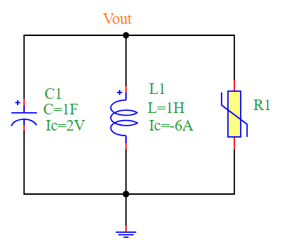
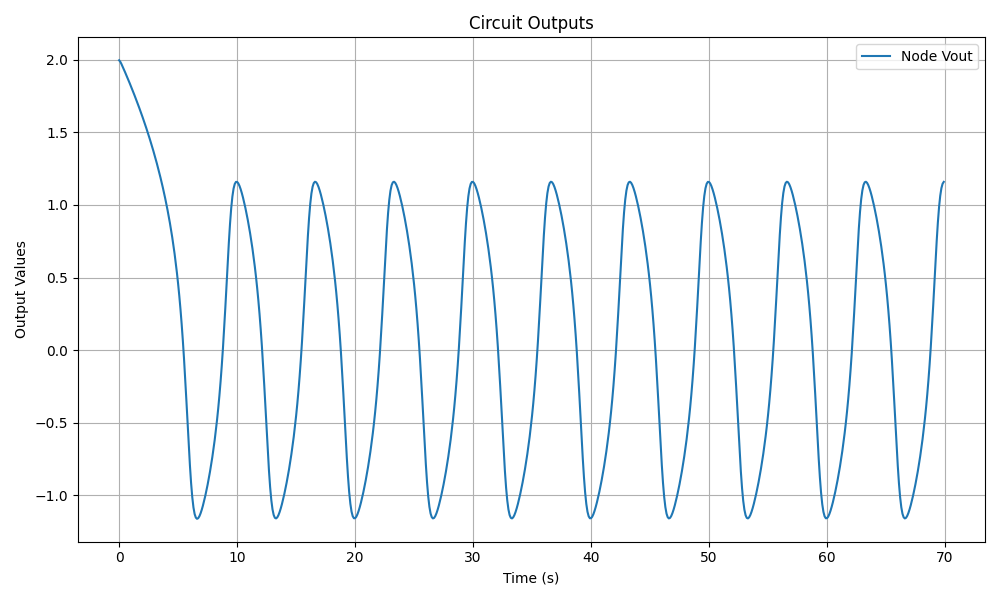
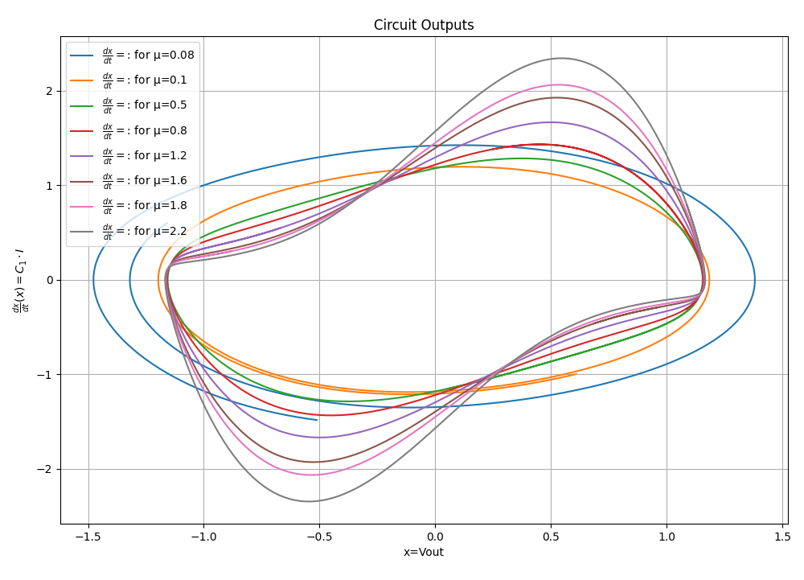

Van der Pol Oscillator
======================

Overview
--------

The Van der Pol oscillator is a **non-conservative** oscillator with **non-linear damping**. It is commonly used in physics, electronics, and biological systems to describe self-sustained oscillations. The oscillator follows the second-order differential equation:

.. math::

   \frac{d^2x}{dt^2} - \mu (1 - x^2) \frac{dx}{dt} + x = 0

In the context of an electrical circuit, the equation takes the form:

.. math::

   C \frac{d^2 v_{out}}{dt^2} + \frac{1}{R} \frac{d v_{out}}{dt} + \frac{1}{L} v_{out} = 0

where the nonlinear resistance is defined as:

.. math::

   R = \frac{1}{\mu(v_{out}^2 - 1)}

Circuit Diagram
---------------

The following circuit diagram represents the **Van der Pol Oscillator**:

Simulation Code
---------------

The following Python script simulates the **Van der Pol Oscillator** using the **PyAMS library**:

.. code-block:: python

   from pyams_lib import model, signal, param
   from pyams_lib import voltage, current

   # Nonlinear Resistance Model
   class NonlinearResistance(model):
       def __init__(self, p, n):
           self.V = signal('in', voltage, p, n)
           self.I = signal('out', current, p, n)
           self.\u03bc = param(1.0, ' ', 'Scalar of nonlinearity')

       def analog(self):
           self.I += self.\u03bc * self.V * (self.V * self.V - 1)

   from pyams_lib import circuit
   from models import CapacitorIc, InductorIc

   # Define Components
   R1 = NonlinearResistance("Vout", "0")
   C1 = CapacitorIc("Vout", "0")
   L1 = InductorIc("Vout", "0")

   # Set Parameters
   C1.setParams("C=1F Ic=2V")
   L1.setParams("Ic=-6A L=1H ")

   # Create Circuit and Add Elements
   circuit = circuit()
   circuit.addElements({'R1': R1, 'C1': C1, 'L1': L1})

   # Set Outputs
   circuit.setOutPuts("Vout")

   # Perform Transient Analysis
   circuit.analysis(mode="tran", start=0, stop=70, step=0.1)
   circuit.run()
   circuit.plot()

Simulation Output
-----------------

The output waveform of the **Van der Pol Oscillator** exhibits self-sustained oscillations, as shown in the figure below:

Simulation and Results for different values of :math:`\mu`
----------------------------------------------------------

Below is the Python code used to simulate the Van der Pol oscillator with  different values of :math:`\mu`.

.. code-block:: python

   from pyams_lib import circuit
   from models import CapacitorIc, InductorIc

   R1 = NonlinearResistance("Vout","0")
   C1 = CapacitorIc("Vout","0")
   L1 = InductorIc("Vout","0")

   C1.setParams("C=1F Ic=2V")
   L1.setParams("Ic=-6A L=1H")

   circuit = circuit()
   circuit.addElements({'R1':R1,'C1':C1,'L1':L1})
   circuit.setOutPuts("Vout", C1.I)

   circuit.analysis(mode="tran", start=10, stop=18, step=0.01)

   import matplotlib.pyplot as plt
   plt.figure(figsize=(10, 6))

   for µ in [0.08, 0.1, 0.5, 0.8, 1.2, 1.6, 1.8, 2.2]:
       print(f"\nCurrent value of µ: {µ}")
       R1.µ += µ
       circuit.run()
       x, dx = circuit.getOutPuts()
       label = rf"$\frac{{dx}}{{dt}}$ for µ={µ}"
       plt.plot(x, dx, label=label)

   plt.xlabel("x = Vout")
   plt.ylabel(r"$\frac{dx}{dt}(x) = C_1 \cdot I$")
   plt.title("Van der Pol Oscillator Phase Space")
   plt.legend()
   plt.grid(True)
   plt.tight_layout()
   plt.show()

Results
-------

Conclusion
----------

The **Van der Pol Oscillator** demonstrates a non-linear damping effect, causing the amplitude of oscillations to stabilize over time. This circuit is widely used to model real-world oscillatory behavior in electronic and biological systems.

