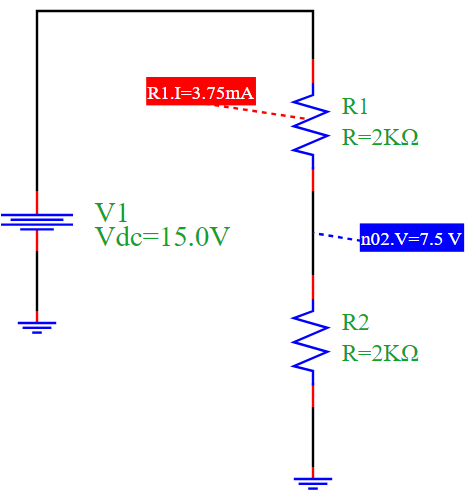

Voltage Divider Simulation
==========================

Overview
--------

This example demonstrates a basic **voltage divider** circuit using PyAMS, which is commonly used to scale down voltages. The circuit consists of:

- A DC voltage source `V1`
- Two resistors `R1` and `R2` in series
- The output voltage is measured across `R2`

The circuit divides the voltage proportionally based on the resistor values.

Circuit Diagram
---------------

Explanation
-----------

According to the voltage divider rule, the voltage across `R2` is given by:

.. math::

   V_{out} = V_{in} \cdot \frac{R2}{R1 + R2}

Given:
- :math:`V_{in} = 15V`
- :math:`R1 = R2 = 2k\Omega`

Then:

.. math::

   V_{out} = 15 \cdot \frac{2000}{2000 + 2000} = 7.5V

The current through the series resistors is:

.. math::

   I = \frac{V_{in}}{R1 + R2} = \frac{15}{4000} = 3.75mA

Python Simulation Code
----------------------

.. code-block:: python

   from pyams.lib import model, signal, param
   from pyams.lib import voltage, current

   # Resistor model using Ohm's Law
   class resistor(model):
       def __init__(self, p, n):
           self.V = signal('in', voltage, p, n)
           self.I = signal('out', current, p, n)
           self.R = param(1000.0, 'Ω', 'Resistance')
           self.Pout = param(1000.0, 'Ω', 'Resistance')

       def analog(self):
           self.I += self.V / self.R

   from pyams.lib import circuit
   from models import DCVoltage

   # Define elements
   V1 = DCVoltage('n1', '0')
   R1 = resistor('n1', 'n2')
   R2 = resistor('n2', '0')

   # Set component parameters
   V1.setParams("Vdc=15V")
   R1.setParams("R=2kΩ")
   R2.setParams("R=2kΩ")

   # Create and simulate circuit
   myCircuit = circuit()
   myCircuit.addElements({'V1': V1, 'R1': R1, 'R2': R2})
   myCircuit.analysis(mode='op')
   myCircuit.run()

   # Output results
   myCircuit.print('n2', R1.I)

Simulation Results
------------------

.. code-block:: text

   Output Voltage at node n2: 7.5 V
   Output Current through R1: 3.75 mA

