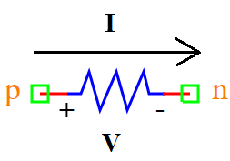

.. include:: ../importCSS.txt

Resistor
=========

:red:`Information`

  
A **resistor** is a passive electrical component that **opposes the flow of electric current**. It follows **Ohm’s Law**, which defines the relationship between voltage, current, and resistance:

.. math::  

    V = R \cdot I

Where:

- $V$ is the voltage across the resistor (Volts)  
- $I$ is the current flowing through the resistor (Amperes)  
- $R$ is the resistance (Ohms, Ω)  

Resistors are used for current limiting, voltage division, and circuit protection.

:red:`Ports`

- **p**: Positive terminal  
- **n**: Negative terminal  

:red:`Model`

The **Resistor model** implements a linear resistor.

    A resistor limits the current flow in a circuit, and the voltage across it 
    is directly proportional to the current through it.

    Attributes:

       *  V (signal): Input voltage signal across the resistor, defined between nodes (p, n).  
       *  I (signal): Output current signal through the resistor, defined between nodes (p, n).  
       *  R (param): Resistance value in Ohms (Ω), default is **1.0 kΩ**.  

    Methods:

        analog(): Defines the resistor behavior using the equation:

.. math::  

    I = \frac{V}{R}

.. code-block:: python

    from pyams.lib import model, signal, param, voltage, current

    class Resistor(model):
        """
        Resistor model based on Ohm’s Law: V = R * I
        """

        def __init__(self, p, n):
            # Signal declaration
            self.V = signal('in', voltage, p, n)
            self.I = signal('out', current, p, n)

            # Parameter declaration
            self.R = param(1e3, 'Ω', 'Resistance value')

        def analog(self):
            """Defines the resistor’s voltage-current relationship"""
            self.I += self.V / self.R

:red:`Command syntax`

The **syntax** for defining a resistor in a PyAMS simulation:

.. code-block:: python

    # Import the model
    from pyams.models import Resistor

    # Rname: is the name of the resistor instance
    # p, n: The connection points in the circuit
    Rname = Resistor(p, n)
