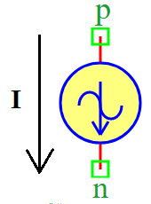

.. include:: ../importCSS.txt

Sin Current
===========

:red:`Information`

A **Sinusoidal Current Source** generates an **AC current waveform** that follows the equation:

.. math::  

    I(t) = I_a \cdot \sin(2\pi \cdot F_r \cdot t + \Phi) + I_{off}

Where:

- $I(t)$ is the output current as a function of time  
- $I_a$ is the amplitude of the sine wave (Amperes)  
- $F_r$ is the frequency of the sine wave (Hertz)  
- $\Phi$ is the phase shift (degrees)  
- $I_{off}$ is the DC offset current (Amperes)  

:red:`Ports`

- **p**: Positive terminal  
- **n**: Negative terminal  

:red:`Model`
  
The **SinCurrent model** represents a **sinusoidal AC current source**.

    This model generates an **alternating current** signal that follows a sine wave function.

    Attributes:

       *  I (signal): Output current through terminals (p, n).  
       *  Fr (param): Frequency of the sine wave, default is **100 Hz**.  
       *  Ia (param): Amplitude of the sine wave, default is **1 A**.  
       *  Ph (param): Phase shift in degrees, default is **0°**.  
       *  Ioff (param): DC offset current, default is **0 A**.  

    Methods:

        analog(): Implements the sinusoidal current equation:

.. math::  

    I = I_a \cdot \sin(2\pi \cdot F_r \cdot t + \Phi) + I_{off}

.. code-block:: python

    from pyams.lib import model, signal, param, time
    from pyams.lib import current
    from math import sin, pi

    class SinCurrent(model):
        """
        Sinusoidal current source model.
        """

        def __init__(self, p, n):
            # Signal declaration
            self.I = signal('out', current, p, n)

            # Parameter declarations
            self.Fr = param(100.0, 'Hz', 'Frequency of sine wave')
            self.Ia = param(1.0, 'A', 'Amplitude of sine wave')
            self.Ph = param(0.0, '°', 'Phase of sine wave')
            self.Ioff = param(0.0, 'A', 'Current offset')

        def analog(self):
            """Implements the sinusoidal current equation."""
            self.I += self.Ia * sin(2 * pi * self.Fr * time + (self.Ph * pi / 180.0)) + self.Ioff

:red:`Command syntax`
 
The **syntax** for defining a sinusoidal current source in a PyAMS simulation:

.. code-block:: python

    # Import the model
    from pyams.models import SinCurrent

    # Iname: is the name of the current source instance
    # p, n: The connection points in the circuit
    Iname = SinCurrent(p, n)
