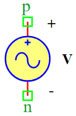

.. include:: ../importCSS.txt

Sin Voltage
===========

:red:`Information`

A **Sinusoidal Voltage Source** generates an **AC voltage waveform** that follows the equation:

.. math::  

    V(t) = V_a \cdot \sin(2\pi \cdot F_r \cdot t + \Phi) + V_{off}

Where:

- $V(t)$ is the output voltage as a function of time  
- $V_a$ is the amplitude of the sine wave (Volts)  
- $F_r$ is the frequency of the sine wave (Hertz)  
- $\Phi$ is the phase shift (degrees)  
- $V_{off}$ is the DC offset voltage (Volts)  

:red:`Ports`

- **p**: Positive terminal  
- **n**: Negative terminal  

:red:`Model`
  
The **SinVoltage model** represents a **sinusoidal AC voltage source**.

    This model generates an **alternating voltage** signal that follows a sine wave function.

    Attributes:

       *  V (signal): Output voltage between terminals (p, n).  
       *  Fr (param): Frequency of the sine wave, default is **100 Hz**.  
       *  Va (param): Amplitude of the sine wave, default is **10 V**.  
       *  Ph (param): Phase shift in degrees, default is **0°**.  
       *  Voff (param): DC offset voltage, default is **0 V**.  

    Methods:

        analog(): Implements the sinusoidal voltage equation:

.. math::  

    V = V_a \cdot \sin(2\pi \cdot F_r \cdot t + \Phi) + V_{off}

.. code-block:: python

    from pyams.lib import model, signal, param, time
    from pyams.lib import voltage
    from math import sin, pi

    class SinVoltage(model):
        """
        Sinusoidal voltage source model.
        """

        def __init__(self, p, n):
            # Signal declaration
            self.V = signal('out', voltage, p, n)

            # Parameter declarations
            self.Fr = param(100.0, 'Hz', 'Frequency of sine wave')
            self.Va = param(10.0, 'V', 'Amplitude of sine wave')
            self.Ph = param(0.0, '°', 'Phase of sine wave')
            self.Voff = param(0.0, 'V', 'Voltage offset')

        def analog(self):
            """Implements the sinusoidal voltage equation."""
            self.V += self.Va * sin(2 * pi * self.Fr * time + (self.Ph * pi / 180.0)) + self.Voff

:red:`Command syntax`

The **syntax** for defining a sinusoidal voltage source in a PyAMS simulation:

.. code-block:: python

    # Import the model
    from pyams.models import SinVoltage

    # Vname: is the name of the voltage source instance
    # p, n: The connection points in the circuit
    Vname = SinVoltage(p, n)
