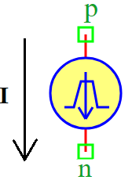

.. include:: ../importCSS.txt

Trapezoid Current
=================

:red:`Information`

A **Trapezoidal Wave Current Source** generates a **current signal** with a linear rise and fall, forming a trapezoidal waveform.

.. math::  
    I(t) =
    \begin{cases} 
    I_0 + I_{off}, & t \leq T_d \\
    \frac{(I_1 - I_0)}{T_r} \cdot t + I_0 + I_{off}, & 0 \leq t \leq T_r \\
    I_1 + I_{off}, & T_r \leq t \leq T_r + T_w \\
    \frac{(I_0 - I_1)}{T_f} \cdot (t - T_r - T_w) + I_1 + I_{off}, & T_r + T_w \leq t \leq T_r + T_w + T_f \\
    I_0 + I_{off}, & t > T_r + T_w + T_f
    \end{cases}

Where:

- $I_0$: Initial current  
- $I_1$: Peak current  
- $T_d$: Initial delay time  
- $T_r$: Rise time  
- $T_w$: Pulse width (high duration)  
- $T_f$: Fall time  
- $T$: Total period of the waveform  
- $I_{off}$: Offset current  

:red:`Ports`

- **p**: Positive terminal  
- **n**: Negative terminal  

:red:`Model`

The **TrapezoidCurrent model** generates a **trapezoidal current signal**.

    This model is useful for **PWM-controlled current sources, transient simulations, and power electronics analysis**.

    Attributes:

       *  I (signal): Output current between terminals (p, n).  
       *  I0 (param): Initial current, default is **1 A**.  
       *  I1 (param): Peak current, default is **1 A**.  
       *  Td (param): Initial delay time, default is **0 sec**.  
       *  Tr (param): Rise time, default is **0 sec**.  
       *  Tw (param): Pulse-width (high duration), default is **0.05 sec**.  
       *  Tf (param): Fall time, default is **0 sec**.  
       *  T (param): Total period of the waveform, default is **0.1 sec**.  
       *  Ioff (param): Offset current, default is **0 A**.  

    Methods:

        analog(): Implements the trapezoidal current equation.
.. code-block:: python

 from pyams.lib import model, time, signal, param
 from pyams.lib import current

  # Trapezoidal Current Source Model 
  class TrapezoidCurrent(model):
    """
    This class models a Trapezoidal Waveform Current Source.
    """

    def __init__(self, p, n):
        # Signal declaration
        self.I = signal('out', current, p, n)

        # Parameter declarations
        self.I0 = param(1.0, 'A', 'Initial current')
        self.I1 = param(1.0, 'A', 'Peak current')
        self.Td = param(0, 'Sec', 'Initial delay time')
        self.Tr = param(0, 'Sec', 'Rise time')
        self.Tw = param(0.05, 'Sec', 'Pulse-width')
        self.Tf = param(0, 'Sec', 'Fall time')
        self.T = param(0.1, 'Sec', 'Total period of the waveform')
        self.Ioff = param(0.0, 'A', 'Offset current')

    def analog(self):
        """Defines the trapezoidal waveform equation for current output."""
        t = time  # Get current simulation time

        # Before initial delay
        if t <= self.Td:
            self.I += self.I0 + self.Ioff
            return

        # Time within the current cycle
        cycle_time = (t - self.Td) % self.T

        # Rising edge: 0 → Tr
        if cycle_time <= self.Tr:
            slope = (self.I1 - self.I0) / self.Tr
            self.I += slope * cycle_time + self.I0 + self.Ioff

        # High state: Tr → (Tr + Tw)
        elif cycle_time <= (self.Tr + self.Tw):
            self.I += self.I1 + self.Ioff

        # Falling edge: (Tr + Tw) → (Tr + Tw + Tf)
        elif cycle_time <= (self.Tr + self.Tw + self.Tf):
            slope = (self.I0 - self.I1) / self.Tf
            self.I += slope * (cycle_time - self.Tr - self.Tw) + self.I1 + self.Ioff

        # Low state: After (Tr + Tw + Tf)
        else:
            self.I += self.I0 + self.Ioff

:red:`Command syntax`
 
The **syntax** for defining a trapezoidal current source in a PyAMS simulation:

.. code-block:: python

    # Import the model
    from pyams.models import TrapezoidCurrent

    # Iname: is the name of the current source instance
    # a, b: The connection points in the circuit
    Iname = TrapezoidCurrent(a, b)
