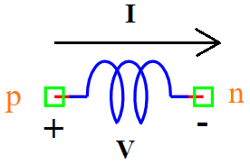

.. include:: ../importCSS.txt

Conductor
=========

.. role:: red

:red:`Information`

An **ideal linear electrical conductor** is an electrical component that allows current to flow with a defined **conductance (G)**. Conductance is the reciprocal of resistance and determines how easily current flows through the conductor.

The relationship between **voltage (V)** and **current (I)** is defined by **Ohm’s Law**:

.. math::

    I = G \cdot V

Where:

- $I$ is the current through the conductor (Amperes)  
- $G$ is the conductance (Siemens, S)  
- $V$ is the voltage across the conductor (Volts)  

In practical circuits, conductors with **high conductance** (low resistance) are used to connect electrical components efficiently.

:red:`Ports`
 
- **p**: First terminal of the conductor  
- **n**: Second terminal of the conductor  

:red:`Model`

The **Conductor model** implements an **ideal linear conductor** with a specified conductance.

    The current through the conductor is directly proportional to the voltage applied,  
    following Ohm's law: I = G * V.

    Attributes:

       *  V (signal): Voltage signal across the conductor, defined between nodes (p, n).  
       *  I (signal): Current signal through the conductor, defined between nodes (p, n).  
       *  G (param): Conductance value in Siemens (S), default is **1.0 S**.  

    Methods:

        analog(): Defines the current-voltage relationship:

.. math::  

    I = G \cdot V

.. code-block:: python

    from pyams.lib import model, signal, param
    from pyams.lib import voltage, current

    class Conductor(model):
        """
        Ideal Linear Electrical Conductor Model.
        Defines the relationship: I = G * V
        """

        def __init__(self, p, n):
            # Signal declaration
            self.V = signal('in', voltage, p, n)
            self.I = signal('out', current, p, n)

            # Parameter declaration
            self.G = param(1.0, '1/Ω', 'Conductance value')

        def analog(self):
            """Defines the conductor behavior where current is proportional to voltage."""
            self.I += self.V * self.G

:red:`Command syntax`

The **syntax** for defining a Conductor in a PyAMS simulation:

.. code-block:: python

    # Import the model
    from models import Conductor

    # Cname: is the name of the Conductor instance
    # p, n: The connection points in the circuit
    Cname = Conductor(p, n)
