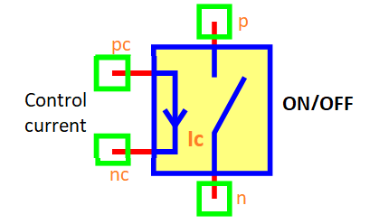

.. include:: ../importCSS.txt

Current-controlled switch
=========================

.. role:: red

:red:`Information`

A current controlled switch is a type of switch whose operation is 
controlled by the input current across at the nodes pc and nc, 
and the switch is turned on or off (open or close) between the nodes p and n.

The current-controlled switch described with the following equation:

switch position on
    .. math::

         if(I_c >=I_{on})

         Switch [on]  \Rightarrow Rs=R_{on}

switch position off
    .. math::

         if(I_c <=I_{off})

         Switch[off] \Rightarrow Rs=R_{off}

* The $Rs$ is resistance of switch.
* The $I_c$ is current control.
* The $I_{on}$ is current for on switch. 
* The $I_{off}$ is current for off switch.       	

:red:`Ports`

* $pc$ Positive control voltage terminal.
* $nc$ Negative control voltage terminal.
* $n$  The switch connects.
* $p$  The switch connects.

:red:`Symbol description`

.. csv-table::
   :header: Field; Value
   :widths: 10, 10
   :delim: ;

   Symbol.name; current controlled switch
   Symbol.file; Switch.sym
   Symbol.directory; Basic
   Symbol.referance; ``S``
   Model.name; ``SwitchC``
   Model.file; SwitchC.py

:red:`PyAMS model`

The current controlled switch model in PyAMS is

.. code-block:: py3

  from PyAMS import model,signal,param
  from electrical import voltage,current
  from Resistor import Resistor

  #Switch control current Model--------------------------------------------------
  class SwitchC(model):
    def __init__(self, pc,nc,p,n):
        #Signals declarations---------------------------------------------------
        self.Ic = signal('in',current,pc,nc)

        #Resistor model---------------------------------------------------------
        self.Rs=Resistor(p,n)

        #Parameters declarations------------------------------------------------
        self.Ion=param(1e-3,'A','Current for on switch')
        self.Ioff=param(-1e-3,'A','Current for off switch')
        self.Ron=param(10.0,'Ω','Resistance on value')
        self.Roff=param(1e+6,'Ω','Resistance on value')
        self.Rint=param(10.0,'Ω','Resistance intiale value')

    def sub(self):
        self.Rs.R=self.Rint
        return [self.Rs]

    def analog(self):
        #Switch on vlaue
        if(self.Ic>=self.Ion):
            self.Rs.R=self.Ron;

        #Switch off vlaue
        if(self.Ic<=self.Ioff):
            self.Rs.R=self.Roff;

:red:`Command syntax`

.. code-block:: py3
    
   #import model
   from SwitchC import *
   
   #Sname: is the name of the model.
   #pc,nc,p,n: The connection position in the circuit.
   Sname=SwitchC(pc,nc,p,n)