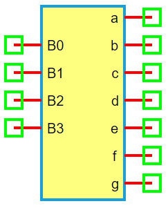

.. include:: ../importCSS.txt

BCD to 7-Segment Decoder
=========================

:red:`Information`

A **BCD (Binary-Coded Decimal) to 7-Segment Decoder** converts a 4-bit BCD input into signals that control a **7-segment display**, typically used to represent decimal digits from 0 to 9. Each of the 7 segments (labeled a–g) is driven high or low to form the appropriate numeral pattern.

:red:`Ports`

- **B0**, **B1**, **B2**, **B3**: BCD input bits (least to most significant)
- **a** to **g**: Segment outputs controlling the display

:red:`Model`

The **BCD7SegmentDecoder model** decodes a 4-bit binary input into the corresponding pattern on a 7-segment display.

    Attributes:

       *  B0–B3 (dsignal): 4-bit BCD inputs  
       *  a–g (dsignal): Outputs to the display segments  

    Methods:

        digital(): Maps BCD input to the correct segment pattern

.. code-block:: python

    from pyams.lib import dsignal, model

    class BCD7SegmentDecoder(model):
        """ BCD to 7-Segment Decoder """
        def __init__(self, B0, B1, B2, B3, a, b, c, d, e, f, g):
            self.B0 = dsignal(direction='in', port=B0)
            self.B1 = dsignal(direction='in', port=B1)
            self.B2 = dsignal(direction='in', port=B2)
            self.B3 = dsignal(direction='in', port=B3)

            self.a = dsignal(direction='out', port=a)
            self.b = dsignal(direction='out', port=b)
            self.c = dsignal(direction='out', port=c)
            self.d = dsignal(direction='out', port=d)
            self.e = dsignal(direction='out', port=e)
            self.f = dsignal(direction='out', port=f)
            self.g = dsignal(direction='out', port=g)

        def digital(self):
            """ Decode 4-bit BCD to 7-segment output """
            b0 = self.B0
            b1 = self.B1
            b2 = self.B2
            b3 = self.B3

            # Segment a
            self.a += ~b3 & ~b2 & ~b1 & b0 | ~b3 & b2 & ~b1 & ~b0
            # Segment b
            self.b += ~b3 & b2 & ~b1 & b0 | ~b3 & b2 & b1 & ~b0
            # Segment c
            self.c += ~b3 & ~b2 & b1 & ~b0
            # Segment d
            self.d += ~b3 & b2 & ~b1 & ~b0 | ~b3 & b2 & b1 & b0
            # Segment e
            self.e += ~b3 & b0 | ~b3 & b2 & ~b1
            # Segment f
            self.f += ~b3 & ~b2 & b0 | ~b3 & ~b2 & b1
            # Segment g
            self.g += ~b3 & ~b2 & ~b1 | ~b3 & b2 & b1 & b0

:red:`Command syntax`

The **syntax** for defining a BCD to 7-segment decoder in a PyAMS simulation:

.. code-block:: python

    # Import the model
    from pyams.models import BCD7SegmentDecoder

    # Create the decoder instance
    SEG = BCD7SegmentDecoder(B0, B1, B2, B3, a, b, c, d, e, f, g)
