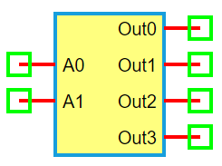

.. include:: ../importCSS.txt

2-to-4 Decoder
===============

:red:`Information`

A **2-to-4 Decoder** is a digital circuit that decodes a **2-bit binary input** into one of **four outputs**. Only one output is high (logic '1') at a time, depending on the input combination. It is often used in address decoding and memory selection logic.

:red:`Truth Table`

.. list-table::
   :header-rows: 1
   :widths: 15 15 15 15 15

   * - A1
     - A0
     - Out0
     - Out1
     - Out2
     - Out3
   * - 0
     - 0
     - 1
     - 0
     - 0
     - 0
   * - 0
     - 1
     - 0
     - 1
     - 0
     - 0
   * - 1
     - 0
     - 0
     - 0
     - 1
     - 0
   * - 1
     - 1
     - 0
     - 0
     - 0
     - 1

:red:`Ports`

- **A0**, **A1**: Binary address inputs  
- **Out0** to **Out3**: Four output lines (only one is high at a time)

:red:`Model`

The **Decoder2to4 model** implements a basic 2-bit input to 4-output binary decoder.

    Attributes:

       *  A0, A1 (dsignal): Input address lines  
       *  Out0–Out3 (dsignal): Four decoder output lines  

    Methods:

        digital(): Activates one output line based on the binary address inputs

.. code-block:: python

    from pyams.lib import dsignal, model

    class Decoder2to4(model):
        """ 2-to-4 Binary Decoder """
        def __init__(self, A0, A1, Out0, Out1, Out2, Out3):
            self.A0 = dsignal(direction='in', port=A0)
            self.A1 = dsignal(direction='in', port=A1)

            self.Out0 = dsignal(direction='out', port=Out0)
            self.Out1 = dsignal(direction='out', port=Out1)
            self.Out2 = dsignal(direction='out', port=Out2)
            self.Out3 = dsignal(direction='out', port=Out3)

        def digital(self):
            """ Perform decoding """
            a0 = self.A0
            a1 = self.A1
            self.Out0 += ~a1 & ~a0
            self.Out1 += ~a1 & a0
            self.Out2 += a1 & ~a0
            self.Out3 += a1 & a0

:red:`Command syntax`

The **syntax** for defining a 2-to-4 decoder in a PyAMS simulation:

.. code-block:: python

    # Import the model
    from pyams.models import Decoder2to4

    # DEC: instance name
    # A0, A1: address inputs; Out0–Out3: output lines
    DEC = Decoder2to4(A0, A1, Out0, Out1, Out2, Out3)
