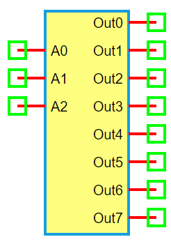

.. include:: ../importCSS.txt

3-to-8 Decoder
===============

:red:`Information`

A **3-to-8 Decoder** is a digital circuit that decodes a **3-bit binary input** into one of **eight outputs**. Only one output is active (logic '1') at a time, determined by the binary value of the inputs. It is commonly used in memory address decoding, control circuits, and data routing.

:red:`Truth Table`

.. list-table::
   :header-rows: 1
   :widths: 10 10 10 10 10 10 10 10 10 10

   * - A2
     - A1
     - A0
     - Out0
     - Out1
     - Out2
     - Out3
     - Out4
     - Out5
     - Out6
     - Out7
   * - 0
     - 0
     - 0
     - 1
     - 0
     - 0
     - 0
     - 0
     - 0
     - 0
     - 0
   * - 0
     - 0
     - 1
     - 0
     - 1
     - 0
     - 0
     - 0
     - 0
     - 0
     - 0
   * - 0
     - 1
     - 0
     - 0
     - 0
     - 1
     - 0
     - 0
     - 0
     - 0
     - 0
   * - 0
     - 1
     - 1
     - 0
     - 0
     - 0
     - 1
     - 0
     - 0
     - 0
     - 0
   * - 1
     - 0
     - 0
     - 0
     - 0
     - 0
     - 0
     - 1
     - 0
     - 0
     - 0
   * - 1
     - 0
     - 1
     - 0
     - 0
     - 0
     - 0
     - 0
     - 1
     - 0
     - 0
   * - 1
     - 1
     - 0
     - 0
     - 0
     - 0
     - 0
     - 0
     - 0
     - 1
     - 0
   * - 1
     - 1
     - 1
     - 0
     - 0
     - 0
     - 0
     - 0
     - 0
     - 0
     - 1

:red:`Ports`

- **A0**, **A1**, **A2**: Binary address inputs  
- **Out0** to **Out7**: Eight output lines (only one is high at a time)

:red:`Model`

The **Decoder3to8 model** implements a basic 3-bit input to 8-output binary decoder.

    Attributes:

       *  A0, A1, A2 (dsignal): Input address lines  
       *  Out0–Out7 (dsignal): Eight decoder output lines  

    Methods:

        digital(): Activates one output line based on the binary address inputs

.. code-block:: python

    from pyams.lib import dsignal, model

    class Decoder3to8(model):
        """ 3-to-8 Binary Decoder """
        def __init__(self, A0, A1, A2, Out0, Out1, Out2, Out3, Out4, Out5, Out6, Out7):
            self.A0 = dsignal(direction='in', port=A0)
            self.A1 = dsignal(direction='in', port=A1)
            self.A2 = dsignal(direction='in', port=A2)

            self.Out0 = dsignal(direction='out', port=Out0)
            self.Out1 = dsignal(direction='out', port=Out1)
            self.Out2 = dsignal(direction='out', port=Out2)
            self.Out3 = dsignal(direction='out', port=Out3)
            self.Out4 = dsignal(direction='out', port=Out4)
            self.Out5 = dsignal(direction='out', port=Out5)
            self.Out6 = dsignal(direction='out', port=Out6)
            self.Out7 = dsignal(direction='out', port=Out7)

        def digital(self):
            """ Perform decoding """
            a0 = self.A0
            a1 = self.A1
            a2 = self.A2
            self.Out0 += ~a2 & ~a1 & ~a0
            self.Out1 += ~a2 & ~a1 & a0
            self.Out2 += ~a2 & a1 & ~a0
            self.Out3 += ~a2 & a1 & a0
            self.Out4 += a2 & ~a1 & ~a0
            self.Out5 += a2 & ~a1 & a0
            self.Out6 += a2 & a1 & ~a0
            self.Out7 += a2 & a1 & a0

:red:`Command syntax`

The **syntax** for defining a 3-to-8 decoder in a PyAMS simulation:

.. code-block:: python

    # Import the model
    from pyams.models import Decoder3to8

    # DEC: instance name
    # A0, A1, A2: address inputs; Out0–Out7: output lines
    DEC = Decoder3to8(A0, A1, A2, Out0, Out1, Out2, Out3, Out4, Out5, Out6, Out7)
