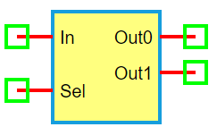

.. include:: ../importCSS.txt

1-to-2 Demultiplexer
=====================

:red:`Information`

A **1-to-2 demultiplexer (DEMUX)** is a digital logic circuit that routes a **single input signal** to **one of two outputs**, based on the value of a **single select line (Sel)**.

- If **Sel = 0**, the input is routed to **Out0**  
- If **Sel = 1**, the input is routed to **Out1**

:red:`Truth Table`

.. list-table::
   :header-rows: 1
   :widths: 15 15 15 15 15

   * - Sel
     - In
     - Out0
     - Out1
   * - 0
     - X
     - In
     - 0
   * - 1
     - X
     - 0
     - In

:red:`Ports`

- **In**: Input signal  
- **Sel**: Select signal  
- **Out0**: First output  
- **Out1**: Second output

:red:`Model`

The **DEMUX1to2 model** implements a basic 1-input, 1-select digital demultiplexer.

    Attributes:

       *  In (dsignal): Digital input  
       *  Sel (dsignal): Select line  
       *  Out0 (dsignal): Output 0  
       *  Out1 (dsignal): Output 1  

    Methods:

        digital(): Routes input based on Sel:

.. code-block:: python

    from pyams.lib import dsignal, model

    class DEMUX1to2(model):
        """ 1-to-2 Demultiplexer """
        def __init__(self, In, Sel, Out0, Out1):
            self.In = dsignal(direction='in', port=In)
            self.Sel = dsignal(direction='in', port=Sel)
            self.Out0 = dsignal(direction='out', port=Out0)
            self.Out1 = dsignal(direction='out', port=Out1)

        def digital(self):
            """ Perform DEMUX logic """
            self.Out0 += ~self.Sel & self.In
            self.Out1 += self.Sel & self.In

:red:`Command syntax`

The **syntax** for defining a 1-to-2 demultiplexer in a PyAMS simulation:

.. code-block:: python

    # Import the model
    from pyams.models import DEMUX1to2

    # DEMUX: instance name
    # In: input; Sel: select; Out0, Out1: outputs
    DEMUX = DEMUX1to2(In, Sel, Out0, Out1)
