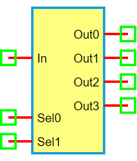

.. include:: ../importCSS.txt

1-to-4 Demultiplexer
=====================

:red:`Information`

A **1-to-4 demultiplexer (DEMUX)** is a digital circuit that takes a **single input** and routes it to **one of four outputs**, depending on the values of two **select lines (Sel0 and Sel1)**.

Selection logic:

- **Sel1 Sel0 = 00** → Out0 = In  
- **Sel1 Sel0 = 01** → Out1 = In  
- **Sel1 Sel0 = 10** → Out2 = In  
- **Sel1 Sel0 = 11** → Out3 = In  

:red:`Truth Table`

.. list-table::
   :header-rows: 1
   :widths: 15 15 15 15 15 15

   * - Sel1
     - Sel0
     - In
     - Out0
     - Out1
     - Out2
     - Out3
   * - 0
     - 0
     - X
     - In
     - 0
     - 0
     - 0
   * - 0
     - 1
     - X
     - 0
     - In
     - 0
     - 0
   * - 1
     - 0
     - X
     - 0
     - 0
     - In
     - 0
   * - 1
     - 1
     - X
     - 0
     - 0
     - 0
     - In

:red:`Ports`

- **In**: Input signal  
- **Sel0**: Least significant select bit  
- **Sel1**: Most significant select bit  
- **Out0–Out3**: Four output signals

:red:`Model`

The **DEMUX1to4 model** implements a 1-input, 2-select digital demultiplexer.

    Attributes:

       *  In (dsignal): Input digital signal  
       *  Sel0, Sel1 (dsignal): Select lines  
       *  Out0–Out3 (dsignal): Four output lines  

    Methods:

        digital(): Routes the input signal to one of the outputs based on Sel1 and Sel0:

.. code-block:: python

    from pyams.lib import dsignal, model

    class DEMUX1to4(model):
        """ 1-to-4 Demultiplexer """
        def __init__(self, In, Sel0, Sel1, Out0, Out1, Out2, Out3):
            self.In = dsignal(direction='in', port=In)
            self.Sel0 = dsignal(direction='in', port=Sel0)
            self.Sel1 = dsignal(direction='in', port=Sel1)
            self.Out0 = dsignal(direction='out', port=Out0)
            self.Out1 = dsignal(direction='out', port=Out1)
            self.Out2 = dsignal(direction='out', port=Out2)
            self.Out3 = dsignal(direction='out', port=Out3)

        def digital(self):
            """ Perform DEMUX logic """
            s0 = self.Sel0
            s1 = self.Sel1
            self.Out0 += ~s1 & ~s0 & self.In
            self.Out1 += ~s1 & s0 & self.In
            self.Out2 += s1 & ~s0 & self.In
            self.Out3 += s1 & s0 & self.In

:red:`Command syntax`

The **syntax** for defining a 1-to-4 demultiplexer in a PyAMS simulation:

.. code-block:: python

    # Import the model
    from pyams.models import DEMUX1to4

    # DEMUX: instance name
    # In: input; Sel0, Sel1: select lines; Out0–Out3: outputs
    DEMUX = DEMUX1to4(In, Sel0, Sel1, Out0, Out1, Out2, Out3)
