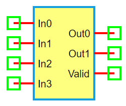

.. include:: ../importCSS.txt

4-to-2 Priority Encoder
=========================

:red:`Information`

A **4-to-2 Priority Encoder** is a digital circuit that encodes the highest-order active input (logic '1') among four inputs into a 2-bit binary output. If multiple inputs are active, the **highest-priority input** determines the output.

Priority order: **In3 > In2 > In1 > In0**

:red:`Truth Table`

.. list-table::
   :header-rows: 1
   :widths: 15 15 15 15 15 15 15

   * - In3
     - In2
     - In1
     - In0
     - Out1
     - Out0
     - Valid
   * - 0
     - 0
     - 0
     - 0
     - 0
     - 0
     - 0
   * - 0
     - 0
     - 0
     - 1
     - 0
     - 0
     - 1
   * - 0
     - 0
     - 1
     - X
     - 0
     - 1
     - 1
   * - 0
     - 1
     - X
     - X
     - 1
     - 0
     - 1
   * - 1
     - X
     - X
     - X
     - 1
     - 1
     - 1

:red:`Ports`

- **In0–In3**: Input lines (active high)  
- **Out0, Out1**: 2-bit encoded binary output  
- **Valid**: Output signal indicating if any input is active (optional)

:red:`Model`

The **Encoder4to2 model** implements a 4-input to 2-output **priority encoder**.

    Attributes:

       *  In0–In3 (dsignal): Four digital input lines  
       *  Out0, Out1 (dsignal): Two binary output lines  
       *  Valid (dsignal): Indicates if an input is active (1), else 0  

    Methods:

        digital(): Outputs the binary representation of the highest active input

.. code-block:: python

    from pyams.lib import dsignal, model

    class Encoder4to2(model):
        """ 4-to-2 Priority Encoder """
        def __init__(self, In0, In1, In2, In3, Out0, Out1, Valid):
            self.In0 = dsignal(direction='in', port=In0)
            self.In1 = dsignal(direction='in', port=In1)
            self.In2 = dsignal(direction='in', port=In2)
            self.In3 = dsignal(direction='in', port=In3)

            self.Out0 = dsignal(direction='out', port=Out0)
            self.Out1 = dsignal(direction='out', port=Out1)
            self.Valid = dsignal(direction='out', port=Valid)

        def digital(self):
            """ Perform priority encoding """
            i0, i1, i2, i3 = self.In0, self.In1, self.In2, self.In3
            self.Valid += i0 | i1 | i2 | i3
            self.Out1 += i2 | i3
            self.Out0 += i1 | i3

:red:`Command syntax`

The **syntax** for defining a 4-to-2 priority encoder in a PyAMS simulation:

.. code-block:: python

    # Import the model
    from pyams.models import Encoder4to2

    # EN: instance name
    # In0–In3: inputs; Out0–Out1: encoded outputs; Valid: activity flag
    EN = Encoder4to2(In0, In1, In2, In3, Out0, Out1, Valid)
