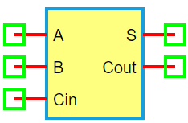

.. include:: ../importCSS.txt

Full Adder
===========

:red:`Information`

A **full adder** is a digital circuit that performs the **addition of three binary bits**: two input bits and a **carry-in (Cin)** from a previous addition. It produces a **sum (S)** and a **carry-out (Cout)**. Full adders are fundamental building blocks for binary addition in multi-bit arithmetic logic units.

Truth table for a full adder:

.. list-table::
   :header-rows: 1
   :widths: 15 15 15 15 15

   * - A
     - B
     - Cin
     - Sum (S)
     - Cout
   * - 0
     - 0
     - 0
     - 0
     - 0
   * - 0
     - 0
     - 1
     - 1
     - 0
   * - 0
     - 1
     - 0
     - 1
     - 0
   * - 0
     - 1
     - 1
     - 0
     - 1
   * - 1
     - 0
     - 0
     - 1
     - 0
   * - 1
     - 0
     - 1
     - 0
     - 1
   * - 1
     - 1
     - 0
     - 0
     - 1
   * - 1
     - 1
     - 1
     - 1
     - 1

:red:`Ports`

- **A**: First input  
- **B**: Second input  
- **Cin**: Carry-in input  
- **S**: Sum output  
- **Cout**: Carry-out output

:red:`Model`

The **FullAdder model** implements a 3-input binary adder.

    Attributes:

       *  A (dsignal): First input digital signal  
       *  B (dsignal): Second input digital signal  
       *  Cin (dsignal): Carry-in input signal  
       *  S (dsignal): Sum output  
       *  Cout (dsignal): Carry-out output  

    Methods:

        digital(): Performs full adder logic using XOR, AND, and OR operations:

.. math::

    S = A \oplus B \oplus Cin \\
    Cout = (A \land B) \lor (Cin \land (A \oplus B))

.. code-block:: python

    from pyams.lib import dsignal, model

    class FullAdder(model):
        """ Digital full adder model """
        def __init__(self, A, B, Cin, S, Cout):
            self.A = dsignal(direction='in', port=A)
            self.B = dsignal(direction='in', port=B)
            self.Cin = dsignal(direction='in', port=Cin)
            self.S = dsignal(direction='out', port=S)
            self.Cout = dsignal(direction='out', port=Cout)

        def digital(self):
            """ Perform full-adder logic """
            AxorB = self.A ^ self.B
            self.S += AxorB ^ self.Cin
            self.Cout += (self.A & self.B) | (self.Cin & AxorB)

:red:`Command syntax`

The **syntax** for defining a full adder in a PyAMS simulation:

.. code-block:: python

    # Import the model
    from pyams.models import FullAdder

    # FA: name of the full adder instance
    # A, B, Cin: inputs; S: sum output; Cout: carry-out output
    FA = FullAdder(A, B, Cin, S, Cout)
