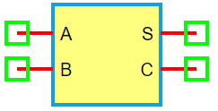

.. include:: ../importCSS.txt

Half Adder
===========

:red:`Information`

A **half adder** is a basic digital circuit that performs the **addition of two single-bit binary numbers**. It has two inputs and two outputs:

- **Sum (S)**: The XOR of the inputs  
- **Carry (C)**: The AND of the inputs

The half adder does not handle carry input from a previous stage, making it suitable for only the **least significant bit (LSB)** in binary addition.

Truth table for a half adder:

.. list-table::
   :header-rows: 1
   :widths: 20 20 20 20

   * - A
     - B
     - Sum (S)
     - Carry (C)
   * - 0
     - 0
     - 0
     - 0
   * - 0
     - 1
     - 1
     - 0
   * - 1
     - 0
     - 1
     - 0
   * - 1
     - 1
     - 0
     - 1

:red:`Ports`

- **A**: First digital input  
- **B**: Second digital input  
- **S**: Sum output (A ⊕ B)  
- **C**: Carry output (A ∧ B)

:red:`Model`

The **HalfAdder model** implements a 2-input binary addition circuit.

    Attributes:

       *  A (dsignal): First input digital signal  
       *  B (dsignal): Second input digital signal  
       *  S (dsignal): Sum output  
       *  C (dsignal): Carry output  

    Methods:

        digital(): Performs XOR for Sum and AND for Carry:

.. math::

    S = A \oplus B \\
    C = A \land B

.. code-block:: python

    from pyams.lib import dsignal, model

    class HalfAdder(model):
        """ Digital half adder model """
        def __init__(self, A, B, S, C):
            self.A = dsignal(direction='in', port=A)
            self.B = dsignal(direction='in', port=B)
            self.S = dsignal(direction='out', port=S)
            self.C = dsignal(direction='out', port=C)

        def digital(self):
            """ Perform half-adder logic """
            self.S += self.A ^ self.B
            self.C += self.A & self.B

:red:`Command syntax`

The **syntax** for defining a half adder in a PyAMS simulation:

.. code-block:: python

    # Import the model
    from pyams.models import HalfAdder

    # HA: name of the half adder instance
    # A, B: inputs; S: sum output; C: carry output
    HA = HalfAdder(A, B, S, C)
