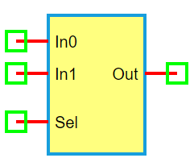

.. include:: ../importCSS.txt

2-to-1 Multiplexer
===================

:red:`Information`

A **2-to-1 multiplexer (MUX)** is a digital circuit that selects one of **two input signals** and forwards it to the output based on a **single select signal (Sel)**. It acts as a **data selector**.

If **Sel = 0**, the output is **In0**;  
If **Sel = 1**, the output is **In1**.

Truth table for 2-to-1 MUX:

.. list-table::
   :header-rows: 1
   :widths: 20 20 20 20

   * - Sel
     - In0
     - In1
     - Out
   * - 0
     - 0
     - X
     - 0
   * - 0
     - 1
     - X
     - 1
   * - 1
     - X
     - 0
     - 0
   * - 1
     - X
     - 1
     - 1

:red:`Ports`

- **In0**: First data input  
- **In1**: Second data input  
- **Sel**: Select signal  
- **Out**: Output signal

:red:`Model`

The **MUX2to1 model** implements a 2-input, 1-select digital multiplexer.

    Attributes:

       *  In0 (dsignal): Input 0  
       *  In1 (dsignal): Input 1  
       *  Sel (dsignal): Select line  
       *  Out (dsignal): Output signal  

    Methods:

        digital(): Outputs In0 if Sel is 0, otherwise In1:

.. math::

    \text{Out} = (\lnot Sel \land In0) \lor (Sel \land In1)

.. code-block:: python

    from pyams.lib import dsignal, model

    class MUX2to1(model):
        """ 2-to-1 Multiplexer """
        def __init__(self, In0, In1, Sel, Out):
            self.In0 = dsignal(direction='in', port=In0)
            self.In1 = dsignal(direction='in', port=In1)
            self.Sel = dsignal(direction='in', port=Sel)
            self.Out = dsignal(direction='out', port=Out)

        def digital(self):
            """ Perform MUX logic """
            self.Out += (~self.Sel & self.In0) | (self.Sel & self.In1)

:red:`Command syntax`

The **syntax** for defining a 2-to-1 multiplexer in a PyAMS simulation:

.. code-block:: python

    # Import the model
    from pyams.models import MUX2to1

    # MUX: instance name
    # In0, In1: data inputs; Sel: select; Out: output
    MUX = MUX2to1(In0, In1, Sel, Out)
