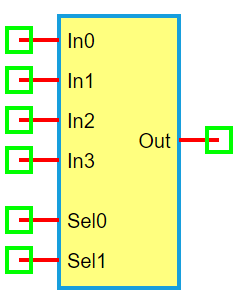

.. include:: ../importCSS.txt

4-to-1 Multiplexer
===================

:red:`Information`

A **4-to-1 multiplexer (MUX)** is a digital circuit that selects one of **four input signals** and forwards it to the output based on the value of **two select lines (Sel0 and Sel1)**.

Selection logic:

- **Sel1 Sel0 = 00** → Out = In0  
- **Sel1 Sel0 = 01** → Out = In1  
- **Sel1 Sel0 = 10** → Out = In2  
- **Sel1 Sel0 = 11** → Out = In3  

:red:`Truth Table`

.. list-table::
   :header-rows: 1
   :widths: 15 15 15 15 15 15 15

   * - Sel1
     - Sel0
     - In0
     - In1
     - In2
     - In3
     - Out
   * - 0
     - 0
     - X
     - X
     - X
     - X
     - In0
   * - 0
     - 1
     - X
     - X
     - X
     - X
     - In1
   * - 1
     - 0
     - X
     - X
     - X
     - X
     - In2
   * - 1
     - 1
     - X
     - X
     - X
     - X
     - In3

:red:`Ports`

- **In0**: Input 0  
- **In1**: Input 1  
- **In2**: Input 2  
- **In3**: Input 3  
- **Sel0**: Least significant select bit  
- **Sel1**: Most significant select bit  
- **Out**: Output signal  

:red:`Model`

The **MUX4to1 model** implements a 4-input, 2-select digital multiplexer.

    Attributes:

       *  In0–In3 (dsignal): Four digital input lines  
       *  Sel0, Sel1 (dsignal): Select lines  
       *  Out (dsignal): Output line  

    Methods:

        digital(): Determines output based on the binary value of (Sel1, Sel0)

.. code-block:: python

    from pyams.lib import dsignal, model

    class MUX4to1(model):
        """ 4-to-1 Multiplexer """
        def __init__(self, In0, In1, In2, In3, Sel0, Sel1, Out):
            self.In0 = dsignal(direction='in', port=In0)
            self.In1 = dsignal(direction='in', port=In1)
            self.In2 = dsignal(direction='in', port=In2)
            self.In3 = dsignal(direction='in', port=In3)
            self.Sel0 = dsignal(direction='in', port=Sel0)
            self.Sel1 = dsignal(direction='in', port=Sel1)
            self.Out = dsignal(direction='out', port=Out)

        def digital(self):
            """ Perform 4-to-1 MUX logic """
            s0 = self.Sel0
            s1 = self.Sel1
            self.Out += (~s1 & ~s0 & self.In0) | \
                        (~s1 & s0 & self.In1) | \
                        (s1 & ~s0 & self.In2) | \
                        (s1 & s0 & self.In3)

:red:`Command syntax`

The **syntax** for defining a 4-to-1 multiplexer in a PyAMS simulation:

.. code-block:: python

    # Import the model
    from pyams.models import MUX4to1

    # MUX4: instance name
    # In0–In3: data inputs; Sel0, Sel1: select lines; Out: output
    MUX4 = MUX4to1(In0, In1, In2, In3, Sel0, Sel1, Out)
