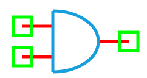

.. include:: ../importCSS.txt

AND Gate
=========

:red:`Information`

A **digital AND gate** is a fundamental logic gate that outputs a logic high (**1**) only if **both** of its inputs are high. It performs a **logical conjunction** operation.

The truth table for a 2-input AND gate is:

.. list-table::
   :header-rows: 1
   :widths: 20 20 20

   * - In1
     - In2
     - Out
   * - 0
     - 0
     - 0
   * - 0
     - 1
     - 0
   * - 1
     - 0
     - 0
   * - 1
     - 1
     - 1

:red:`Ports`

- **In1**: First digital input  
- **In2**: Second digital input  
- **Out**: Digital output (result of In1 AND In2)

:red:`Model`

The **AND model** implements a standard 2-input digital AND logic gate.

    A digital AND gate outputs logic 1 only when both inputs are at logic 1.

    Attributes:

       *  In1 (dsignal): First input digital signal  
       *  In2 (dsignal): Second input digital signal  
       *  Out (dsignal): Output digital signal  

    Methods:

        digital(): Performs the logical AND operation between input signals:

.. math::

    \text{Out} = \text{In1} \land \text{In2}

.. code-block:: python

    from pyams.lib import dsignal, model, circuit

    class AND(model):
        """ Digital AND gate model """
        def __init__(self, In1, In2, Out):
            # Digital Signal declarations
            self.In1 = dsignal(direction='in', port=In1)
            self.In2 = dsignal(direction='in', port=In2)
            self.Out = dsignal(direction='out', port=Out)

        def digital(self):
            """ Perform AND operation """
            self.Out += self.In1 & self.In2

:red:`Command syntax`

The **syntax** for defining an AND gate in a PyAMS simulation:

.. code-block:: python

    # Import the model
    from pyams.models import AND

    # ANDname: name of the AND gate instance
    # In1, In2, Out: digital signal ports
    ANDname = AND(In1, In2, Out)
