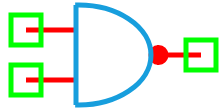

.. include:: ../importCSS.txt

NAND Gate
==========

:red:`Information`

A **digital NAND gate** is a combination of an **AND gate followed by a NOT gate**. It outputs a logic low (**0**) only if **all** of its inputs are high; otherwise, the output is logic high (**1**). It performs the **negation of the logical conjunction**.

The truth table for a 2-input NAND gate is:

.. list-table::
   :header-rows: 1
   :widths: 20 20 20

   * - In1
     - In2
     - Out
   * - 0
     - 0
     - 1
   * - 0
     - 1
     - 1
   * - 1
     - 0
     - 1
   * - 1
     - 1
     - 0

:red:`Ports`

- **In1**: First digital input  
- **In2**: Second digital input  
- **Out**: Digital output (result of NOT(In1 AND In2))

:red:`Model`

The **NAND model** implements a standard 2-input digital NAND logic gate.

    A digital NAND gate outputs logic 0 only when both inputs are logic 1.

    Attributes:

       *  In1 (dsignal): First input digital signal  
       *  In2 (dsignal): Second input digital signal  
       *  Out (dsignal): Output digital signal  

    Methods:

        digital(): Performs the logical NAND operation:

.. math::

    \text{Out} = \lnot (\text{In1} \land \text{In2})

.. code-block:: python

    from pyams.lib import dsignal, model, circuit

    class NAND(model):
        """ Digital NAND gate model """
        def __init__(self, In1, In2, Out):
            # Digital Signal declarations
            self.In1 = dsignal(direction='in', port=In1)
            self.In2 = dsignal(direction='in', port=In2)
            self.Out = dsignal(direction='out', port=Out)

        def digital(self):
            """ Perform NAND operation """
            self.Out += ~(self.In1 & self.In2)

:red:`Command syntax`

The **syntax** for defining a NAND gate in a PyAMS simulation:

.. code-block:: python

    # Import the model
    from pyams.models import NAND

    # NANDname: name of the NAND gate instance
    # In1, In2, Out: digital signal ports
    NANDname = NAND(In1, In2, Out)
