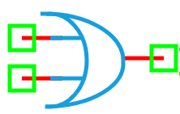

.. include:: ../importCSS.txt

OR Gate
========

:red:`Information`

A **digital OR gate** is a fundamental logic gate that outputs a logic high (**1**) if **at least one** of its inputs is high. It performs a **logical disjunction** operation.

The truth table for a 2-input OR gate is:

.. list-table::
   :header-rows: 1
   :widths: 20 20 20

   * - In1
     - In2
     - Out
   * - 0
     - 0
     - 0
   * - 0
     - 1
     - 1
   * - 1
     - 0
     - 1
   * - 1
     - 1
     - 1

:red:`Ports`

- **In1**: First digital input  
- **In2**: Second digital input  
- **Out**: Digital output (result of In1 OR In2)

:red:`Model`

The **OR model** implements a standard 2-input digital OR logic gate.

    A digital OR gate outputs logic 1 if at least one input is at logic 1.

    Attributes:

       *  In1 (dsignal): First input digital signal  
       *  In2 (dsignal): Second input digital signal  
       *  Out (dsignal): Output digital signal  

    Methods:

        digital(): Performs the logical OR operation between input signals:

.. math::

    \text{Out} = \text{In1} \lor \text{In2}

.. code-block:: python

    from pyams.lib import dsignal, model, circuit

    class OR(model):
        """ Digital OR gate model """
        def __init__(self, In1, In2, Out):
            # Digital Signal declarations
            self.In1 = dsignal(direction='in', port=In1)
            self.In2 = dsignal(direction='in', port=In2)
            self.Out = dsignal(direction='out', port=Out)

        def digital(self):
            """ Perform OR operation """
            self.Out += self.In1 | self.In2

:red:`Command syntax`

The **syntax** for defining an OR gate in a PyAMS simulation:

.. code-block:: python

    # Import the model
    from pyams.models import OR

    # ORname: name of the OR gate instance
    # In1, In2, Out: digital signal ports
    ORname = OR(In1, In2, Out)
