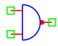

.. include:: ../importCSS.txt

NAND gate
=========

.. role:: red

:red:`Symbol`

:red:`Information`

The NAND gate or  NOT-AND gate which is equal to an AND gate followed by a NOT gate.
The outputs of all NAND gates are high if any of the inputs are low.

:red:`Ports`

* $In1$ input terminal type electrical.
* $In2$ input terminal type electrical.
* $Out$ output terminal type electrical.

:red:`Symbol description`

.. csv-table::
   :header: Field; Value
   :widths: 10, 10
   :delim: ;

   Symbol.name; NAND
   Symbol.file; NAND.sym
   Symbol.directory; Digital
   Symbol.referance; ``X``
   Model.name; ``NAND``
   Model.file; NAND.py

:red:`PyAMS model`

The NAND gate model in PyAMS is

.. code-block:: py3

 from PyAMS import model,signal,param
 from electrical import voltage

 # NAND Gate Model---------------------------------------------------------------
 class NAND(model):
     def __init__(self,Out,In1,In2):
        #Signals declarations---------------------------------------------------
         self.Vin1 = signal('in',voltage,In1)
         self.Vin2 = signal('in',voltage,In2)
         self.Vout = signal('out',voltage,Out)
        #Parameter declarations-------------------------------------------------
         self.IL=param(0.2,'V','in low voltage')
         self.IH=param(3.2,'V','in high voltage')
         self.OL=param(0.0,'V','out low voltage')
         self.OH=param(5.0,'V','out high voltage')

     def analog(self):
         if((self.Vin1<=self.IL)or(self.Vin2<=self.IL)):
            self.Vout+=self.OH
         elif((self.Vin1>=self.IH)and(self.Vin2>=self.IH)):
            self.Vout+=self.OL

