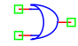

.. include:: ../importCSS.txt

OR gate
=======

.. role:: red

:red:`Symbol`

:red:`Information`

The OR gate is an electronic circuit that gives a high output (1) if one or more of its inputs are high.

:red:`Ports`

* $In1$ input terminal type electrical.
* $In2$ input terminal type electrical.
* $Out$ output terminal type electrical.

:red:`Symbol description`

.. csv-table::
   :header: Field; Value
   :widths: 10, 10
   :delim: ;

   Symbol.name; OR
   Symbol.file; OR.sym
   Symbol.directory; Digital
   Symbol.referance; ``X``
   Model.name; ``OR``
   Model.file; OR.py

:red:`PyAMS model`

The OR gate model in PyAMS is

.. code-block:: py3

 from PyAMS import model,signal,param
 from electrical import voltage

 # OR Gate Model-----------------------------------------------------------------
 class OR(model):
     def __init__(self,O,I1,I2):
        #Signals declarations---------------------------------------------------
         self.In1 = signal('in',voltage,I1,'0')
         self.In2 = signal('in',voltage,I2,'0')
         self.Out = signal('out',voltage,O,'0')
        #Parameter declarations-------------------------------------------------
         self.IL=param(0.2,'V','In low voltage')
         self.IH=param(3.2,'V','In high voltage')
         self.OL=param(0.0,'V','Out low voltage')
         self.OH=param(5.0,'V','Out high voltage')

     def analog(self):
         if((self.In1<=self.IL) and (self.In2<=self.IL)):
            self.Out+=self.OL
         elif((self.In1>=self.IH) or (self.In2>=self.IH)):
            self.Out+=self.OH

